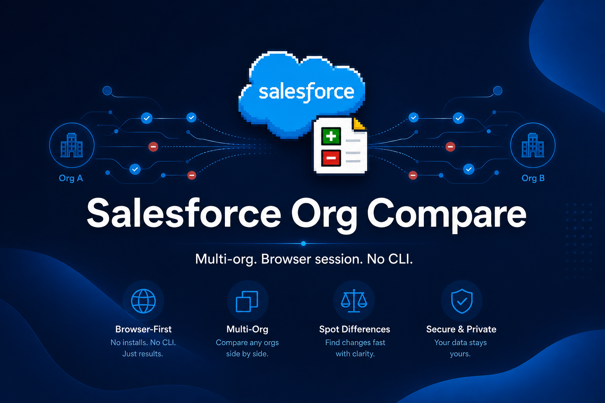
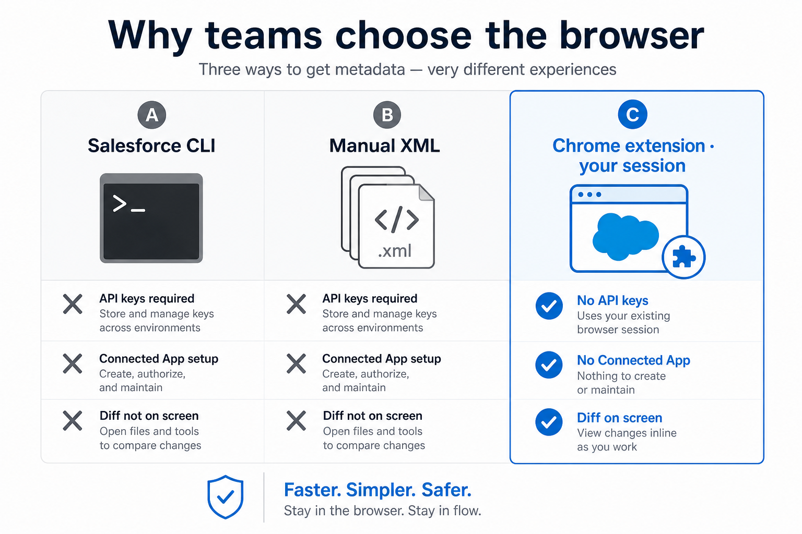
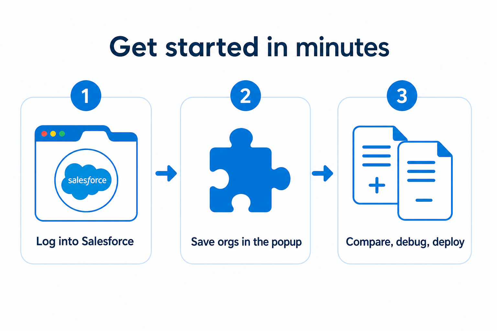
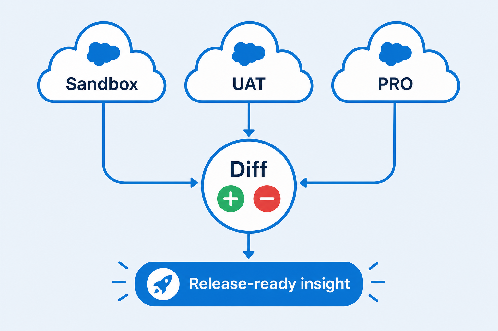
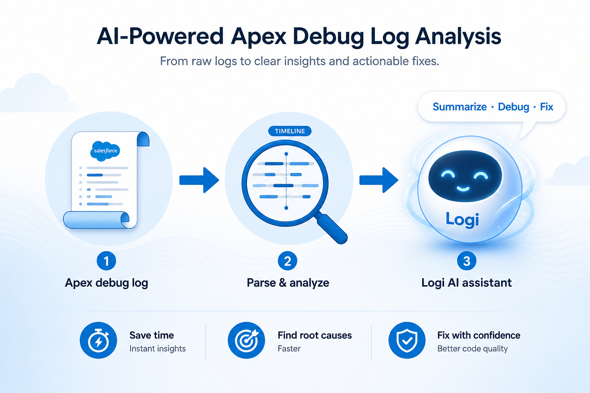
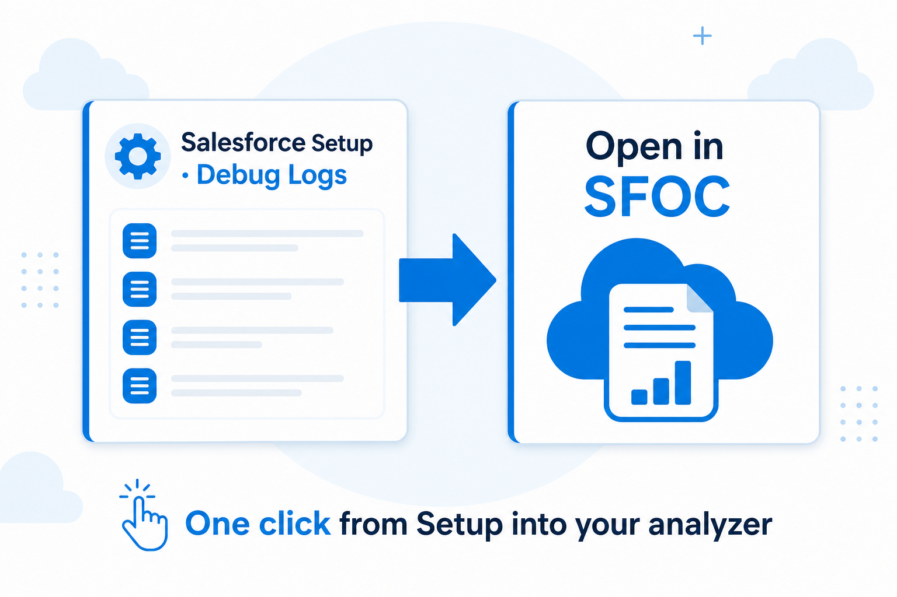

# Salesforce Org Compare

[](https://chromewebstore.google.com/detail/salesforce-org-compare/mpocihehhnklfhplkdlmahmopinjnpcg)
[](https://chromewebstore.google.com/detail/salesforce-org-compare/mpocihehhnklfhplkdlmahmopinjnpcg)
[](https://chromewebstore.google.com/detail/salesforce-org-compare/mpocihehhnklfhplkdlmahmopinjnpcg)
[](LICENSE)
[](https://salesforceorgcompare.com/)

**Compare Salesforce orgs with the browser session you already have — no Salesforce CLI, no Connected App, no API keys.**

[Website](https://salesforceorgcompare.com/) · [Privacy](PRIVACY.md) · Built for admins, developers, and release managers who live in multiple orgs every day.



---

## Why teams choose the browser

Skip Connected Apps, API keys, and CLI installs for day-to-day compare and debug work. Use the Salesforce session you already have open in Chrome.



| | |
|---|---|
| **Your session, not new credentials** | Reuses the Salesforce tab you already logged into |
| **Multi-org in one place** | Save PRO, UAT, and sandboxes with aliases and jump between them |
| **Diff on screen** | Metadata and code comparison — export HTML when you need a report |
| **Dev hub in Chrome** | Apex tests, SOQL, Quick Edit, REST, debug logs, and more |
| **Free** | Available on the Chrome Web Store |

---

## How it works



1. **Log into Salesforce** in Chrome.
2. **Save orgs** from the extension popup (aliases, groups).
3. **Compare, debug, or open logs** from the main app — or jump in from Setup when UI Integration is enabled.

---

## Usage flows

### Compare orgs before a release

Sandbox → UAT → PRO: pull metadata, see what changed, ship with confidence.



### Debug faster with Logi 

From a raw Apex debug log to parsed analysis to an optional AI assist (**Logi**: summarize, debug, suggest fixes). Free tier or BYOK OpenRouter. Opt-in.

Access is invite-only during beta — [request access](https://salesforceorgcompare.com/solicitar-acceso-logi/) with your installation ID (Settings → About).



### Open logs from Salesforce Setup

Optional **Salesforce UI Integration**: one click from Setup Debug Logs into SFOC. Opt-in in Settings; only for saved orgs with an active session.



> **Trademark notice:** Salesforce Org Compare is a third-party tool and is not affiliated with or endorsed by Salesforce, Inc.

---

## Table of contents

**Product**

- [Why teams choose the browser](#why-teams-choose-the-browser)
- [How it works](#how-it-works)
- [Usage flows](#usage-flows)
- [Features](#features)

**Technical**

- [Security and Privacy](#security-and-privacy)
- [Installation](#installation)
- [Troubleshooting](#troubleshooting)
- [Contributions](#contributions)
- [Development](#development)
- [Project Structure](#project-structure)
- [Third-Party Libraries](#third-party-libraries)
- [About](#about)
- [License](#license)

---

## Features

### Metadata Comparator

- Search and index metadata across saved orgs
- Retrieve source and compare side by side with Monaco Editor
- Export diffs to HTML
- Support for Apex, LWC, Aura, Visualforce, Permission Sets, Profiles, FlexiPages, and more
- Persist compared items locally between sessions

### Development

| Tool | Description |
|------|-------------|
| **Apex Tests** | Run and manage Apex test jobs |
| **Apex Coverage Compare** | Compare code coverage between orgs |
| **Quick Edit** | Edit and deploy Apex classes |
| **Lightning Quick Edit** | Deploy Lightning bundles |
| **Anonymous Apex** | Execute anonymous Apex |
| **Query Explorer** | Build and run SOQL queries |
| **REST Explorer** | Interact with Salesforce REST APIs |
| **Debug Log Browser** | Browse and filter debug logs |
| **Event Monitor** | Subscribe to Platform Events in real time |

### Analysis

| Tool | Description |
|------|-------------|
| **Field Dependency** | Explore field dependencies |
| **Dependency Explorer** | Analyze metadata dependencies |
| **Permission Diff** | Compare permission sets and profiles |
| **Object Describe** | Inspect object and field metadata |
| **Data Workbench** | Import, export, and edit records |
| **Custom Settings Compare** | Diff custom settings across orgs |
| **Custom Metadata Compare** | Diff custom metadata types |
| **Record Compare** | Compare individual records |

### Monitoring

| Tool | Description |
|------|-------------|
| **Environment Status** | Trust status and instance health |
| **Org Limits** | View org limits and usage |
| **Deploy Status** | Track metadata deployments |
| **Bulk Job Monitor** | Monitor bulk API jobs |
| **Setup Audit Trail** | Review setup change history |
| **Field History** | Inspect field history tracking |

### Manifests

| Tool | Description |
|------|-------------|
| **Generate Package.xml** | Build `package.xml` from selected metadata |
| **Metadata Type Compare** | Compare all members of a metadata type |

### Standalone Viewers

- **Apex Log Viewer** — advanced debug log parsing and analysis
- **Logi**  — optional AI advisor inside the Apex Log Viewer (summarize, chat, quick actions). [Request beta access](https://salesforceorgcompare.com/solicitar-acceso-logi/).
- **Apex Coverage Viewer** — coverage visualization
- **Apex Source Viewer** — focused Apex source inspection

### Salesforce UI Integration (`sfInject`)

- Opt-in in Settings → Salesforce UI Integration
- **Open in SFOC** on Apex Debug Logs (Lightning Setup and Classic list)
- Reorder Debug Logs table above User Trace Flags (with pagination)
- **Deployment Status → Inline error details** for failed deployments only; opt-in, supports multiple expanded rows, and Ctrl+click opens Apex classes in SFOC.
- **Deployment detail → Open Apex classes** adds an org selector and Ctrl+click/Cmd+click source links for Component Errors, Test Errors, and Apex stack-trace frames.

### Popup & Settings

- Manage saved orgs (aliases, groups, drag-and-drop ordering)
- Detect the org from the active browser tab
- Light / dark appearance (Settings + toolbar toggle)
- Language (EN/ES), telemetry opt-out, export/import settings
- Favorites and recent tools in the main app

---

## Security and Privacy

The Salesforce Org Compare extension communicates **directly between your browser and Salesforce**. Org data is not sent to third-party servers for processing (except when you explicitly use optional features such as Logi).

- Authentication reuses your existing Salesforce browser session (session cookie read at runtime; never stored in extension storage).
- API calls use the official Salesforce REST and Metadata APIs with the permissions of the logged-in user.
- Preferences, saved org aliases, and locally cached metadata are stored in `chrome.storage.local` on your device.
- Optional usage telemetry is sent to PostHog (EU region) and can be disabled in extension settings. Telemetry does not include Salesforce record data.
- Logi (when enabled and used) sends log excerpts / chat to an LLM via a secure proxy or your own OpenRouter key — only when you invoke Logi.
- Salesforce UI Integration is opt-in and runs as local DOM enhancement on matching Setup pages for saved orgs.
- The extension requires cookie access for Salesforce domains to obtain the session token used by the Salesforce UI.

For a full summary, see [PRIVACY.md](PRIVACY.md). The complete privacy policy is available at [salesforceorgcompare.com/privacy-policy](https://salesforceorgcompare.com/privacy-policy).

To validate this description, inspect the source code or monitor network traffic in your browser DevTools.

---

## Installation

### Get the extension

Visit **[salesforceorgcompare.com](https://salesforceorgcompare.com/)** for the latest release and Chrome Web Store link.

### Local installation (from source)

1. Clone this repository.
2. Open `chrome://extensions/` in Chrome.
3. Enable **Developer mode**.
4. Click **Load unpacked**.
5. Select the **root directory** of this repository (the folder containing `manifest.json`).

---

## Troubleshooting

- **Extension not detecting your org** — Make sure you are logged into Salesforce in the same browser profile and refresh the Salesforce tab.
- **Org not found after enabling My Domain** — Restart your browser or clear the old `sid` cookie for the previous Salesforce domain.
- **Missing icons when loading unpacked** — Ensure the `icons/` folder with `icon-16.png`, `icon-32.png`, `icon-48.png`, and `icon-128.png` is present (required by `manifest.json`).
- **Salesforce UI Integration not visible** — Enable it in Settings, confirm the org is saved, and open a supported Apex Debug Logs Setup URL.

---

## Contributions

Contributions are welcome! Please open an issue to discuss significant changes before starting development.

**Before submitting a pull request:**

1. Describe the problem or feature clearly in the issue.
2. Keep changes focused and follow existing code style.
3. Run unit tests (`npm test`) and test the extension manually in Chrome after loading unpacked.

---

## Development

### Prerequisites

- [Node.js](https://nodejs.org/) with npm

### Setup

```bash
npm install
```

`npm install` runs `prepare`, which rebuilds the Salesforce UI Integration content bundle via `sfInject/bundle.mjs` (the committed `sfInject/content/bundle.js` is what the extension loads).

### Load in Chrome

1. Open `chrome://extensions/`.
2. Enable **Developer mode**.
3. Click **Load unpacked**.
4. Select the repository root.

### Build & package

```bash
npm run build:sf-inject   # Rebuild sfInject content bundle
npm run minify:extension  # Minify for production
npm run pack:chrome       # Package for Chrome Web Store (Windows PowerShell)
```

### Telemetry config (local only)

Copy `shared/telemetryConfig.example.js` to `shared/telemetryConfig.js` and fill in your PostHog key if needed. This file is gitignored and must never be committed.

### Unit tests

```bash
npm test
```

Uses Vitest. Tests live under `tests/`.

---

## Project Structure

| Path | Purpose |
|------|---------|
| `manifest.json` | Chrome MV3 extension manifest |
| `background.js` | Service worker entry point |
| `background/` | Message handlers, org auth, caches, telemetry |
| `popup/` | Extension popup and settings UI |
| `code/` | Main app — comparator, tools, Monaco editor |
| `sfInject/` | Salesforce UI Integration (content scripts, injectors, `bundle.mjs`) |
| `shared/` | Shared APIs, i18n, feature controls |
| `vendor/` | Third-party libraries (Monaco Editor, etc.) |
| `media/readme/` | README marketing and usage images |
| `icons/` | Extension icons |
| `tests/` | Unit tests (Vitest) |

---

## Third-Party Libraries

This extension uses third-party open-source libraries. See [THIRD_PARTY_NOTICES.md](THIRD_PARTY_NOTICES.md) for attribution and license details.

---

## About

Built by **[Ángel Picado](https://es.linkedin.com/in/angelcubo01)**.

- Website: [salesforceorgcompare.com](https://salesforceorgcompare.com/)
- LinkedIn: [es.linkedin.com/in/angelcubo01](https://es.linkedin.com/in/angelcubo01)

---

## License

[MIT](LICENSE) — Copyright (c) 2026 Ángel Picado
