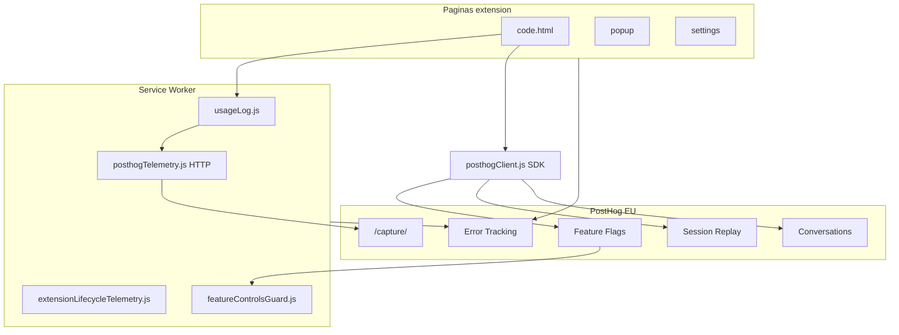
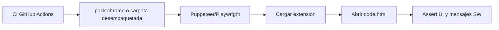

# Herramientas de desarrollador y administrador — Salesforce Org Compare

Catálogo de capacidades de observabilidad, operaciones y profesionalización del producto. Complementa el runbook operativo del kill switch en [`SFOC_FEATURE_CONTROLS.md`](SFOC_FEATURE_CONTROLS.md).

**Alcance:** recomendaciones revisables; no incluye implementación ni configuración real en PostHog.

---

## 1. Resumen ejecutivo

Salesforce Org Compare (SFOC) ya dispone de una base sólida de telemetría anónima (PostHog EU), control remoto de funcionalidades, error tracking y consentimiento del usuario. Los principales huecos están en **operación diaria del equipo** (runbooks, alertas, dashboards), **herramientas in-app de diagnóstico** y **cobertura analítica homogénea** entre todas las herramientas.

| Área | Ya existe | Gap principal |
|------|-----------|---------------|
| Telemetría de uso | PostHog EU, opt-out, eventos por herramienta | Sin visor local ni runbook general de eventos |
| Kill switch | `sfoc_feature_controls` + guards en service worker | Segmentación por versión vía payload (`minVersion`, etc.) |
| Errores | `$exception` independiente del consentimiento de uso | Sin alertas ni runbook de triage documentado |
| Replay / soporte | Flags `sfoc_session_replay`, `sfoc_support`, `sfoc_popup_controls` | Ver [SFOC_POPUP_CONTROLS.md](./SFOC_POPUP_CONTROLS.md) |
| Admin in-app | Ajustes, backup JSON, sección avanzada técnica | Sin panel de diagnóstico ni changelog post-actualización |

### Arquitectura actual

**Proyecto PostHog:** default project `191202` · [Panel EU](https://eu.posthog.com/project/191202)

---

## 2. Inventario de lo que ya tenéis (baseline)

No duplicar trabajo en estas piezas; son el punto de partida.

| Capacidad | Archivos principales | Notas |
|-----------|---------------------|-------|
| Telemetría HTTP (SW) | [`background/posthogTelemetry.js`](../background/posthogTelemetry.js), [`background/usageLog.js`](../background/usageLog.js) | Eventos de uso y ciclo de vida sin depender del SDK en SW |
| SDK PostHog (páginas) | [`shared/posthogClient.js`](../shared/posthogClient.js) | Flags, CSAT, replay, soporte; duplica `usage:log` en cliente |
| Mapeo eventos | [`shared/posthogEventMap.js`](../shared/posthogEventMap.js) | `usage:log` → `comparison_run` / `extension_usage` |
| Sanitización PII | [`shared/usageLogEntry.js`](../shared/usageLogEntry.js), [`shared/posthogEventMap.js`](../shared/posthogEventMap.js) | Allowlist de campos; URLs sin rutas sensibles |
| Kill switch | [`shared/featureControls.js`](../shared/featureControls.js), [`shared/posthogFeatureControlsFlag.js`](../shared/posthogFeatureControlsFlag.js) | Flag `sfoc_feature_controls` — [editar en PostHog](https://eu.posthog.com/project/191202/feature_flags/204164) |
| Guards SW | [`background/featureControlsGuard.js`](../background/featureControlsGuard.js) | Deploy, retrieve, tests, anonymous apex |
| UI kill switch | [`code/ui/featureControlsUi.js`](../code/ui/featureControlsUi.js) | Banners, modales, `feature_control_blocked` |
| Ciclo de vida | [`background/extensionLifecycleTelemetry.js`](../background/extensionLifecycleTelemetry.js) | `extension_installed`, `extension_updated`, `extension_active` |
| Consentimiento | [`shared/extensionSettings.js`](../shared/extensionSettings.js), [`popup/settings.js`](../popup/settings.js), [`popup/popup.js`](../popup/popup.js) | Opt-out por defecto activo; aviso primera visita en popup |
| Errores | [`shared/installEarlyExceptionCapture.js`](../shared/installEarlyExceptionCapture.js), [`shared/extensionExceptionReport.js`](../shared/extensionExceptionReport.js) | `$exception` no depende del toggle de telemetría de uso |
| Session replay | [`shared/posthogSessionReplay.js`](../shared/posthogSessionReplay.js) | Flag `sfoc_session_replay`; masking Monaco |
| Soporte in-app | [`shared/posthogSupport.js`](../shared/posthogSupport.js), [`code/ui/appSupport.js`](../code/ui/appSupport.js) | Flag `sfoc_support`; requiere telemetría ON |
| CSAT | [`shared/posthogCsatSurvey.js`](../shared/posthogCsatSurvey.js) | Tras N eventos `comparison_run` locales |
| Ajustes usuario | [`popup/settings.html`](../popup/settings.html) | Idioma, tema, backup, límites técnicos, telemetría |
| Runbook kill switch | [`SFOC_FEATURE_CONTROLS.md`](SFOC_FEATURE_CONTROLS.md) | Única doc operativa previa a este documento |

### Eventos de ciclo de vida y consentimiento (sin `usage:log`)

| Evento PostHog | Origen | Cuándo |
|----------------|--------|--------|
| `extension_installed` | [`background/extensionLifecycleTelemetry.js`](../background/extensionLifecycleTelemetry.js) | Primera instalación |
| `extension_updated` | Idem | Actualización de versión |
| `extension_active` | Idem | Startup navegador, alarm 12 h, boot SW |
| `telemetry_enabled` | [`background/posthogTelemetry.js`](../background/posthogTelemetry.js) | Consentimiento por defecto (primera vez) |
| `telemetry_opt_in` | Idem | Reactivación en Ajustes |
| `telemetry_opt_out` | Idem | Desactivación en Ajustes |
| `$exception` | SW + páginas | Errores no capturados / `captureUiException` |
| `feature_control_blocked` | [`code/ui/featureControlsUi.js`](../code/ui/featureControlsUi.js) | Bloqueo UI por kill switch (solo si telemetría ON) |

---

## 3. Recomendaciones PostHog (ampliar lo existente)

Cada ítem incluye etiqueta de ámbito, esfuerzo estimado (**S** = días, **M** = 1–2 semanas, **L** = varias semanas) y prioridad sugerida (ver sección 7).

### 3.1 Alertas y triage de errores `[PostHog]` — P0, esfuerzo S

**Objetivo:** detectar regresiones tras publicar una versión sin depender de que alguien abra PostHog manualmente.

| Acción | Detalle |
|--------|---------|
| Alertas en Error Tracking | Nuevo issue, pico de `$exception` (>2× baseline 24 h), spike tras `extension_updated` |
| Dashboard de issues | Desglose por `extension_version`, `artifact_type`, `app_mode`, `phase` |
| Runbook de triage | Flujo: issue → propiedades → replay URL (ya en excepciones) → suprimir ruido benigno |
| Supresión documentada | ResizeObserver, workers Monaco — ya filtrados en código; documentar en runbook |

**Dependencias:** ninguna en código; configuración en PostHog EU.

### 3.2 Dashboards de producto `[PostHog]` — P1, esfuerzo M

**Objetivo:** visibilidad de adopción y salud del producto para el equipo CC.

| Insight / dashboard | Query / dimensión |
|---------------------|-------------------|
| Adopción por herramienta | `comparison_run` agrupado por `artifact_type` |
| Embudo de activación | `extension_installed` → `extension_active` → `comparison_run` (7 días) |
| Retención semanal | Usuarios con `extension_active` que vuelven en semana N+1 |
| Versión en despliegue | Distribución de `extension_version` en eventos recientes |
| Opt-out | Tasa `telemetry_opt_out` / instalaciones |
| Kill switch | Volumen `feature_control_blocked` por `action` y `tool` |

**Deuda de repo:** [`package.json`](../package.json) referencia `npm run posthog:user-dashboard` pero el script `scripts/createPosthogUserDashboard.mjs` **no existe** (solo está `createPosthogFeatureControlsFlag.mjs`). Recuperar el script versiona el dashboard como infraestructura reproducible.

### 3.3 Experimentos y flags más allá del kill switch `[PostHog]` `[In-app]` — P0–P1, esfuerzo M

**Objetivo:** rollout gradual y operaciones sin publicar extensión.

| Propuesta | Descripción | Esfuerzo |
|-----------|-------------|----------|
| Rollout gradual por herramienta | Flag dedicado por feature nueva (no solo JSON global del kill switch) | M |
| Cohortes | Por `extension_version`, idioma UI ([`telemetryAudienceContext.js`](../shared/telemetryAudienceContext.js)), audiencia interna | M |
| `minExtensionVersion` en payload | Banner «actualiza la extensión» si manifest < mínimo | S |
| Scheduled Changes (PostHog) | Ventanas de mantenimiento programadas en el flag | S (config) |
| Refresh flags al foco | Recargar flags al recuperar foco de `code.html` (hoy TTL ~30 min) | S |
| Experimentos A/B UX | Orden de menú, texto onboarding, landing Compare | L |

Las tres primeras filas de «ideas futuras» en [`SFOC_FEATURE_CONTROLS.md`](SFOC_FEATURE_CONTROLS.md) se detallan aquí; ver también sección 8 (roadmap).

### 3.4 Encuestas y feedback `[PostHog]` — P2, esfuerzo S–M

| Encuesta | Trigger | Valor |
|----------|---------|-------|
| CSAT | Ya implementado — N `comparison_run` | Satisfacción general |
| Post-incidente | Tras activar kill switch global (evento o flag) | Calidad de comunicación en incidentes |
| NPS trimestral | Cohortes activas (`extension_active` ≥3 en 90 días) | Lealtad |
| Micro-encuesta por herramienta | Primera vez que `usage:log` emite un `artifact_type` nuevo | Feedback contextual |

Correlacionar respuestas con `extension_version`, `artifact_type` y enlace a replay cuando exista.

**Deuda:** scripts `posthog:survey` / `posthog:survey:update` ausentes en `scripts/`.

### 3.5 Session Replay operativo `[PostHog]` — P2, esfuerzo S

| Uso | Cómo |
|-----|------|
| Playlists | Sesiones con `feature_control_blocked`, `$exception` recurrente, primer `comparison_run` |
| Sample rate remoto | Ajustar en payload de `sfoc_session_replay` sin release |
| Debug local | `window.sfocDebugSessionReplay()` ya expuesto en Compare |

**Deuda:** `scripts/createPosthogSessionReplayFlag.mjs` ausente.

### 3.6 Signals / vigilancia proactiva `[PostHog]` — P2–P3, esfuerzo L

Scouts programados que emiten hallazgos al inbox de PostHog:

| Scout | Vigila |
|-------|--------|
| Anomalía de uso | Caída >40 % de `comparison_run` vs baseline 7 días |
| Post-release | Pico de `$exception` en 2 h tras subir `extension_version` |
| Opt-out | Spike de `telemetry_opt_out` |
| Gaps de instrumentación | Herramientas en menú sin eventos `usage:log` (ver apéndice) |

Notificación a Slack/email del equipo Contact Center.

---

## 4. Herramientas in-app para desarrollador y soporte

Funcionalidades dentro de la extensión, no solo en PostHog.

### 4.1 Panel «Diagnóstico» en Ajustes `[In-app]` — P1, esfuerzo M

Visible con flag interno o build de desarrollo.

| Campo | Fuente |
|-------|--------|
| Versión manifest | `chrome.runtime.getManifest().version` |
| Install ID (truncado) | [`telemetryInstallId.js`](../shared/telemetryInstallId.js) |
| Telemetría on/off | [`extensionSettings.js`](../shared/extensionSettings.js) |
| Estado flags | `sfoc_feature_controls`, `sfoc_session_replay`, `sfoc_support`, `sfoc_popup_controls` |
| Última recarga de flags | Timestamp en [`posthogFeatureFlagLoader.js`](../shared/posthogFeatureFlagLoader.js) |
| Tema UI / Monaco | Settings snapshot |
| **Copiar informe de soporte** | JSON sin SIDs, sin código, sin tokens |

Incluir toggle para `DEBUG_LOGS` (hoy `false` fijo en [`background/config.js`](../background/config.js)).

### 4.2 Visor local de eventos recientes `[In-app]` — P2, esfuerzo M

Ring buffer de los últimos 50 `usage:log` en `chrome.storage.local`:

- Solo si telemetría ON **o** modo diagnóstico activo
- Misma sanitización que [`usageLogEntry.js`](../shared/usageLogEntry.js)
- Permite soporte L1 sin acceso a PostHog

### 4.3 «Novedades» tras actualización `[In-app]` `[PostHog]` — P1, esfuerzo M

- Detectar `extension_updated` (ya en lifecycle)
- Mostrar modal/banner en Compare con changelog
- Fuente: payload de flag PostHog o JSON en Firebase Hosting (`salesforceorgcompare.com`)
- Enlazar con onboarding existente ([`onboardingPrefs.js`](../shared/onboardingPrefs.js))

### 4.4 Centro de privacidad ampliado `[In-app]` — P1, esfuerzo S

Unificar en Ajustes:

- Qué se envía / qué **nunca** se envía (código, credenciales, SIDs)
- Enlace a política de privacidad
- Exportar / rotar `install_id` (GDPR-light, derecho al olvido)
- Complementa aviso popup y textos en [`i18n.js`](../shared/i18n.js)

### 4.5 Override de flags para QA `[In-app]` `[Repo/ops]` — P0, esfuerzo S

- `chrome.storage.local` key de desarrollo para inyectar payload de `sfoc_feature_controls`
- O query param solo en build no publicada
- Acelera pruebas del runbook en [`SFOC_FEATURE_CONTROLS.md`](SFOC_FEATURE_CONTROLS.md)

---

## 5. Herramientas operativas / repo

Para el equipo que mantiene la extensión.

### 5.1 Restaurar scripts PostHog faltantes `[Repo/ops]` — P0, esfuerzo M

Scripts referenciados en [`package.json`](../package.json) pero **ausentes** en `scripts/`:

| Script npm | Archivo esperado | Estado |
|------------|------------------|--------|
| `posthog:feature-controls-flag` | `createPosthogFeatureControlsFlag.mjs` | Existe |
| `posthog:survey` | `createPosthogCsatSurvey.mjs` | Falta |
| `posthog:replay-flag` | `createPosthogSessionReplayFlag.mjs` | Falta |
| `posthog:user-dashboard` | `createPosthogUserDashboard.mjs` | Falta |
| `posthog:support-domain` | `createPosthogSupportExtensionDomain.mjs` | Falta |
| `posthog:support-flag` | `createPosthogSupportFlag.mjs` | Falta |

Además: plantilla versionada `shared/telemetryConfig.example.js` — hoy [`shared/telemetryConfig.js`](../shared/telemetryConfig.js) está en [`.gitignore`](../.gitignore) y es obligatoria para el build de Chrome Store ([`scripts/pack-chrome-store.ps1`](../scripts/pack-chrome-store.ps1)).

### 5.2 Runbooks adicionales en `docs/` `[Repo/ops]` — P0, esfuerzo S

| Documento propuesto | Contenido |
|--------------------|-----------|
| `SFOC_TELEMETRY.md` | Catálogo de eventos, propiedades, consentimiento, privacidad |
| `SFOC_INCIDENT_RESPONSE.md` | Secuencia: flag → aviso global → monitorizar `feature_control_blocked` → postmortem |
| `SFOC_RELEASE_CHECKLIST.md` | Versión, flags, dashboard, alertas, smoke test |

Este documento (`SFOC_DEV_ADMIN_TOOLS.md`) cubre el inventario y roadmap; los runbooks serían procedimentales paso a paso.

### 5.3 Página de desinstalación `[Repo/ops]` — P2, esfuerzo S

[`UNINSTALL_FEEDBACK_URL`](../code/core/constants.js) → `https://salesforceorgcompare.com/uninstall-feedback.html`

- Configurada en [`extensionLifecycleTelemetry.js`](../background/extensionLifecycleTelemetry.js) vía `chrome.runtime.setUninstallURL`
- Documentar evento esperado `extension_uninstalled` en la página externa (código no en este repo)
- Encuesta opcional de motivo de baja

### 5.4 CI/CD de observabilidad `[Repo/ops]` — P0, esfuerzo S

| Check | Descripción |
|-------|-------------|
| Contrato payload | Validar JSON de ejemplo contra schema de [`featureControls.js`](../shared/featureControls.js) |
| Smoke post-release | `npm run posthog:feature-controls-flag:smoke` (ya definido) |
| Tests unitarios | Cobertura extensa en `tests/posthog*.test.js`, `tests/telemetry*.test.js` |

---

## 6. Funcionalidades más allá de PostHog

Ideas que PostHog no cubre bien en una extensión Chrome + Salesforce.

| Idea | Etiqueta | Valor | Notas |
|------|----------|-------|-------|
| Status page / estado del servicio | `[Repo/ops]` | Comunicar incidentes SF API o SFOC | Página estática + banner vía `global` en feature controls |
| Health check de org | `[Salesforce]` `[In-app]` | Latencia API, límites, versión API | Extender herramienta Org Limits existente |
| Audit trail de la extensión | `[In-app]` | Log local: deploy, borrar org, import backup | No sustituye Setup Audit Trail de Salesforce |
| Políticas de seguridad por org | `[In-app]` `[PostHog]` | Bloquear deploy en PROD sin confirmación extra | Vía `actions` en feature controls |
| Modo mantenimiento offline | `[In-app]` | Compare con cache de flags válido | Parcial: [`featureControlsCache.js`](../shared/featureControlsCache.js) |
| Telemetría de rendimiento | `[In-app]` `[PostHog]` | Duración retrieve, diff, deploy | Añadir `duration_ms` a `usage:log` |
| Feature adoption scorecard | `[PostHog]` | Informe mensual automatizado | Script + dashboard |
| Integración Linear / Jira | `[PostHog]` | Ticket desde error PostHog | Webhook PostHog → issue tracker |
| Query Explorer instrumentado | `[In-app]` | Uso de SOQL explorer | Hoy sin `usage:log` (ver apéndice) |
| Debug Log Browser instrumentado | `[In-app]` | Adopción de visor de logs | Hoy sin `usage:log` |

### 6.1 Qué hace PostHog y qué no (en una frase)

| PostHog **sí** | PostHog **no** |
|----------------|----------------|
| Medir uso agregado, errores, replay, encuestas | Ejecutar retrieve/deploy ni hablar con Salesforce |
| Flags remotos (kill switch) | Guardar sesiones SF, SIDs ni código del usuario |
| Alertas sobre métricas ya enviadas | Bloquear una acción **en el momento** del clic (solo avisos vía payload) |
| Analizar cohortes históricas | Sustituir backup, export/import ni políticas por org |
| Soporte chat (Conversations) | Validar límites API, latencia o salud de la org en vivo |

Todo lo de la columna derecha son **capacidades de producto** que debéis construir en la extensión o en tooling de repo — o integrar con herramientas que no sean analítica.

### 6.2 Capacidades complementarias (priorizadas para SFOC)

#### A. Operación y Salesforce (el núcleo del valor)

PostHog no sustituye la herramienta; estas piezas **refuerzan** la confianza operativa:

| Capacidad | Qué resuelve | Estado / propuesta |
|-----------|--------------|-------------------|
| **Pre-flight antes de deploy** | Resumen: org destino, sandbox vs prod, tamaño del cambio, confirmación extra en PROD | Nuevo — alto valor CaixaBank |
| **Health de org en vivo** | Límites API, latencia, versión API, sesión caducada | Parcial — extender Org Limits |
| **Cola de trabajos largos** | Retrieve/tests con notificación [`chrome.notifications`](../manifest.json) al terminar | Parcial — Apex tests ya hace polling |
| **Detector de sesión expirada** | Aviso proactivo en popup antes de que falle el comparador | Mejora UX, no analítica |
| **Allowlist de orgs** (opcional enterprise) | Solo orgs autorizadas pueden deploy | Política interna, no PostHog |

#### B. Gobernanza y auditoría (local, sin enviar a la nube)

| Capacidad | Qué resuelve | Por qué no es PostHog |
|-----------|--------------|---------------------|
| **Audit trail de la extensión** | Quién (usuario SF), qué acción (deploy, import backup, borrar org), cuándo, a qué org | PostHog agrega eventos; no es registro forense local ni exportable bajo demanda |
| **Historial de deploys recientes** | Últimos N deploys con enlace al diff | Operativo para el desarrollador, no métrica |
| **Modo «solo lectura» por org** | Compare/retrieve sí; deploy/anonymous apex no | Enforcement en SW, no dashboard |
| **Exportar informe de auditoría** | JSON/CSV para compliance interno | Datos sensibles — mejor local que SaaS |

Setup Audit Trail de Salesforce (herramienta ya en SFOC) audita **la org**; esto audita **acciones hechas desde la extensión**.

#### C. Datos del usuario (100 % local)

Ya tenéis piezas; PostHog no debe absorberlas:

| Capacidad | Archivo / estado |
|-----------|------------------|
| Backup / restore JSON | [`popup/settings.js`](../popup/settings.js) |
| Orgs, alias, grupos, scripts Apex | `chrome.storage.sync` / `local` |
| Preferencias técnicas | [`extensionSettings.js`](../shared/extensionSettings.js) |
| **Centro de privacidad + borrar install_id** | Propuesto (R11) — derecho al olvido sin depender de PostHog |

#### D. Desarrollo y release (repo, no SaaS)

| Herramienta | Qué hace que PostHog no hace |
|-------------|------------------------------|
| **CI + E2E** (Playwright/Puppeteer) | Prueba que la extensión carga y el SW responde — ver §11 |
| **Validación de manifest** | Permisos y CSP antes de subir a la store |
| **`pack:chrome`** | Artefacto publicable |
| **Contrato de payload kill switch** | El flag remoto no se valida solo en PostHog |

#### E. Integraciones internas (CaixaBank / Contact Center)

| Integración | Uso |
|-------------|-----|
| **ServiceNow / Jira** | Ticket desde «Copiar informe de soporte», no solo desde error en PostHog |
| **Confluence / runbooks** | Enlaces contextuales en ayuda in-app por herramienta |
| **Status Salesforce** | [status.salesforce.com](https://status.salesforce.com) + banner si hay incidente en tu pod |
| **SF CLI / Git** (largo plazo) | Comparar org vs rama Git; PostHog no versiona metadata |

#### F. Experiencia de producto (no medible como funnel)

| Capacidad | Ejemplo |
|-----------|---------|
| **Onboarding por herramienta** | Ya existe — [`onboardingPrefs.js`](../shared/onboardingPrefs.js) |
| **Quick Open / atajos** | Productividad, no telemetría |
| **Ayuda contextual** | [`appHelp.js`](../code/ui/appHelp.js) — reduce soporte sin grabar sesión |
| **Changelog in-app** | Usuario entiende qué cambió; PostHog solo sabe que hubo `extension_updated` |

### 6.3 Matriz rápida — dónde invertir si PostHog «ya está»

| Si necesitáis… | Construid en SFOC | No esperéis de PostHog |
|---------------|-------------------|------------------------|
| Saber si Quick Edit se usa poco | Dashboard `artifact_type` | Que avise al usuario |
| Evitar deploy accidental a PROD | Pre-flight + política por org | Kill switch global |
| Soporte sin acceso a PostHog | Panel Diagnóstico + ring buffer local | Replay (requiere permiso/consentimiento) |
| Compliance «quién desplegó qué» | Audit trail local exportable | Eventos agregados |
| Detectar org al límite de API | Health check en Org Limits | Alertas sobre `comparison_run` |
| Publicar sin romper la extensión | CI + E2E + manifest validate | Error tracking post-release |

### 6.4 Top 5 recomendaciones «no PostHog» para el siguiente trimestre

1. **Pre-flight de deploy** con confirmación reforzada en orgs no sandbox.
2. **Audit trail local** de acciones destructivas (deploy, import replace, remove org).
3. **Health de org** ampliado (latencia + límites + sesión) en un solo panel.
4. **Informe de soporte** copiable desde Ajustes (sin PostHog, sin SIDs).
5. **CI GitHub Actions** + smoke E2E de extensión cargada.

---

## 7. Matriz de priorización

| ID | Propuesta | Prioridad | Esfuerzo | Etiquetas |
|----|-----------|-----------|----------|-----------|
| R01 | Restaurar scripts PostHog en `scripts/` | P0 | M | Repo/ops |
| R02 | Runbook `SFOC_TELEMETRY.md` + `SFOC_INCIDENT_RESPONSE.md` | P0 | S | Repo/ops |
| R03 | Alertas básicas Error Tracking | P0 | S | PostHog |
| R04 | `minExtensionVersion` en feature controls | P0 | S | In-app, PostHog |
| R05 | Refresh flags al recuperar foco | P0 | S | In-app |
| R06 | `telemetryConfig.example.js` versionado | P0 | S | Repo/ops |
| R07 | Override flags para QA | P0 | S | In-app |
| R08 | Dashboard adopción por herramienta | P1 | M | PostHog |
| R09 | Panel Diagnóstico en Ajustes | P1 | M | In-app |
| R10 | Changelog / novedades post-update | P1 | M | In-app, PostHog |
| R11 | Centro de privacidad en Ajustes | P1 | S | In-app |
| R12 | Duración en eventos `usage:log` | P1 | M | In-app, PostHog |
| R13 | Instrumentar herramientas sin telemetría | P1 | M | In-app |
| R14 | Ring buffer eventos locales | P2 | M | In-app |
| R15 | Encuestas post-incidente / NPS | P2 | M | PostHog |
| R16 | Playlists de replay operativas | P2 | S | PostHog |
| R17 | Health check de org ampliado | P2 | M | Salesforce, In-app |
| R18 | Audit trail acciones destructivas | P2 | M | In-app |
| R19 | PostHog Signals / scouts | P2–P3 | L | PostHog |
| R20 | Experimentos A/B UX | P3 | L | PostHog, In-app |
| R21 | Status page pública | P3 | M | Repo/ops |
| R22 | Webhook errores → Jira/Linear | P3 | M | PostHog |
| C01 | Alinear versiones manifest / package.json | P0 | S | Repo/ops |
| C02 | CI GitHub Actions (test + pack) | P0 | M | Repo/ops |
| C03 | ESLint + reglas extensión Chrome | P0 | S | Repo/ops |
| C04 | CONTRIBUTING + release checklist CWS | P0 | S | Repo/ops |
| C05 | E2E Puppeteer/Playwright smoke | P1 | L | Repo/ops |
| C06 | Extension Reloader (flujo dev) | P1 | S | Repo/ops |

Ver sección **11** para el catálogo completo del ecosistema Chrome.

---

## 8. Roadmap sugerido

### Fase 1 — Fundamentos operativos (1–2 sprints)

- R01–R07, **C01–C04** (versiones, CI, ESLint, docs de release)
- Smoke test tras cada release en Chrome Web Store

### Fase 2 — Profesionalización core (2–3 sprints)

- R08–R13, **C05–C06** (E2E smoke, flujo dev con Extension Reloader)
- Dashboard de versión en despliegue y embudo de activación

### Fase 3 — Diferenciación y largo plazo (continuo)

- R14–R22 según capacidad del equipo
- Revisión trimestral de cobertura del apéndice A

---

## 9. Riesgos y límites

### Privacidad y Chrome Web Store

- El modelo de consentimiento actual (opt-out por defecto, aviso en popup) debe mantenerse en nuevas capacidades analíticas.
- Session replay y soporte requieren dominio `chrome-extension://<id>` autorizado en PostHog.
- No enviar código fuente, metadata completa ni tokens SID — ya aplicado en [`usageLogEntry.js`](../shared/usageLogEntry.js).
- El panel de diagnóstico **no debe** exponer session tokens ni contenido de org.

### Limitaciones técnicas

- Flags PostHog: propagación hasta ~30 min en pestañas abiertas (ver [`SFOC_FEATURE_CONTROLS.md`](SFOC_FEATURE_CONTROLS.md)).
- `$exception` se envía aunque el usuario desactive telemetría de uso — documentar claramente en centro de privacidad.
- Autocapture / heatmaps de posthog-js tienen utilidad limitada en UI de extensión (`chrome-extension://`).

### Dependencias externas

- PostHog EU (proyecto `191202`) — punto único de analítica.
- Firebase Hosting para feedback de desinstalación — fuera del repo.

---

## Apéndice A — Mapa `usage:log` → PostHog

Pipeline: UI → [`code/core/bridge.js`](../code/core/bridge.js) → [`background/messageHandlers.js`](../background/messageHandlers.js) (`usage:log`) → [`background/usageLog.js`](../background/usageLog.js) → [`background/posthogTelemetry.js`](../background/posthogTelemetry.js).

Regla de nombre en PostHog ([`posthogEventMap.js`](../shared/posthogEventMap.js)): si `kind === 'codeComparison'` o hay `artifactType` → **`comparison_run`**; en caso contrario → **`extension_usage`**.

### A.1 Emisores verificados en código

| `artifactType` | Archivo emisor | Trigger / `phase` / `action` | Evento PostHog |
|----------------|----------------|------------------------------|----------------|
| *(dinámico: tipo metadata)* | [`code/editor/editorRender.js`](../code/editor/editorRender.js) | Render diff al abrir ítem (`phase: render`). Excluye PermissionSet, Profile, FlexiPage, PackageXml | `comparison_run` |
| *(dinámico: tipo metadata)* | [`code/flows/retrieveFlow.js`](../code/flows/retrieveFlow.js) | Pulsación «Ejecutar retrieve» (`viaRetrieveZip: true`) | `comparison_run` |
| `ApexTests` | [`code/ui/apexTestUsageLog.js`](../code/ui/apexTestUsageLog.js) | Ejecución asíncrona de tests (`phase: runTestsAsynchronous`) | `comparison_run` |
| `ApexClassQuickEdit` | [`code/ui/quickEditPanel.js`](../code/ui/quickEditPanel.js) | Acciones deploy/validate/search (`action` en entry) | `comparison_run` |
| `LightningQuickEdit` | [`code/ui/lightningQuickEditPanel.js`](../code/ui/lightningQuickEditPanel.js) | Acciones deploy/validate/search de bundles LWC/Aura | `comparison_run` |
| `AnonymousApex` | [`code/ui/anonymousApexPanel.js`](../code/ui/anonymousApexPanel.js) | Ejecución de script anónimo | `comparison_run` |
| `DependencyExplorer` | [`code/ui/dependencyExplorerPanel.js`](../code/ui/dependencyExplorerPanel.js) | Análisis, compare, copy, csv (`phase`: analyze, compare, copy, csv) | `comparison_run` |
| `ApexTrigger` | [`code/ui/dependencyExplorerPanel.js`](../code/ui/dependencyExplorerPanel.js) | Análisis desde contexto trigger | `comparison_run` |
| `FieldDependency` | [`code/ui/fieldDependencyPanel.js`](../code/ui/fieldDependencyPanel.js) | Clic en comparar dependencia de campo | `comparison_run` |
| `FieldHistory` | [`code/ui/fieldHistoryPanel.js`](../code/ui/fieldHistoryPanel.js) | Consulta historial (`action: fieldHistoryQuery`) | `comparison_run` |
| `PermissionDiff` | [`code/ui/permissionDiffPanel.js`](../code/ui/permissionDiffPanel.js) | Consulta diff permisos (`action: permissionDiffQuery`) | `comparison_run` |
| `CustomMetadataCompare` | [`code/ui/setupRecordsComparePanelCommon.js`](../code/ui/setupRecordsComparePanelCommon.js) | Comparación registros (`action: setupRecordsCompare`) | `comparison_run` |
| `CustomSettingsCompare` | [`code/ui/setupRecordsComparePanelCommon.js`](../code/ui/setupRecordsComparePanelCommon.js) | Idem | `comparison_run` |
| `PackageXml` | [`code/ui/generatePackageXmlPanel.js`](../code/ui/generatePackageXmlPanel.js) | Generar XML (`phase: packageXml`) o retrieve (`phase: retrieve`) | `comparison_run` |

**Tipos dinámicos en comparador** (`editorRender`, `retrieveFlow`): cualquier `item.type` de metadata soportado (p. ej. `ApexClass`, `LightningComponentBundle`, `CustomObject`, `PermissionSet` vía retrieve, etc.).

### A.2 Herramientas del menú sin `usage:log` (gap de instrumentación — R13)

Estas herramientas están en el producto pero **no** emiten `usage:log` hoy; no aparecerán en dashboards de adopción por `artifact_type`:

| Herramienta (modo) | Archivo panel principal |
|--------------------|-------------------------|
| Query Explorer | [`code/ui/queryExplorerPanel.js`](../code/ui/queryExplorerPanel.js) |
| Debug Log Browser | [`code/ui/debugLogBrowserPanel.js`](../code/ui/debugLogBrowserPanel.js) |
| Apex Coverage Compare | [`code/ui/apexCoverageComparePanel.js`](../code/ui/apexCoverageComparePanel.js) |
| Org Limits | [`code/ui/orgLimitsPanel.js`](../code/ui/orgLimitsPanel.js) |
| Setup Audit Trail (SF) | [`code/ui/setupAuditTrailPanel.js`](../code/ui/setupAuditTrailPanel.js) |

### A.3 Propiedades habituales en `comparison_run`

Campos permitidos en telemetría ([`usageLogEntry.js`](../shared/usageLogEntry.js)): `kind`, `artifactType`, `phase`, `action`, org labels/URLs (sin tokens), `descriptor`, `comparisonUrl` (sanitizada), métricas de diff (`leftFilesCount`, `diffBlocks`, …), `viaRetrieveZip`, `success`, `rowCount`, etc.

Contexto de usuario/org enriquecido en SW: [`telemetryOrgContext.js`](../shared/telemetryOrgContext.js), [`telemetryUserContext.js`](../shared/telemetryUserContext.js).

### A.4 Duplicación cliente + service worker

[`shared/posthogClient.js`](../shared/posthogClient.js) también envía `usage:log` desde la página (CSAT y coherencia con session replay). El SW es la fuente principal vía HTTP.

---

## 11. Herramientas del ecosistema Chrome (desarrollo de la extensión)

Esta sección complementa las secciones 3–6: no son capacidades **dentro** de SFOC para el usuario final, sino **herramientas y prácticas** que podéis adoptar como equipo que mantiene una extensión **Manifest V3** sin bundler (código ES modules cargado directamente desde [`manifest.json`](../manifest.json)).

### 11.1 Lo que ya tenéis

| Herramienta | Uso en SFOC |
|-------------|-------------|
| **Vitest** | Tests unitarios de lógica compartida (`tests/*.test.js`) — sin DOM ni Chrome APIs reales |
| **`npm run pack:chrome`** | ZIP para Chrome Web Store ([`scripts/pack-chrome-store.ps1`](../scripts/pack-chrome-store.ps1)) |
| **VS Code tasks** | Ejecutar tests desde el IDE ([`.vscode/tasks.json`](../.vscode/tasks.json)) |
| **PostHog** | Telemetría, errores, flags, replay (sección 3) |
| **Chrome DevTools** | Inspección manual de popup, `code.html`, service worker |

### 11.2 Depuración y desarrollo local

| Herramienta | Qué aporta | Prioridad | Esfuerzo |
|-------------|------------|-----------|----------|
| **Service Worker en `chrome://extensions`** | Inspeccionar [`background.js`](../background.js): logs, breakpoints, estado tras sleep del SW | Imprescindible | — (ya disponible) |
| **Extension Reloader** (extensión auxiliar) | Recarga automática al guardar archivos; evita ir a «Actualizar» en cada cambio | Alta | S |
| **Carga desempaquetada + «Actualizar»** | Flujo oficial; mantener una ventana con popup y otra con Compare abierto | Imprescindible | — |
| **`chrome://extensions/?errors=`** | Errores de manifest, CSP, permisos denegados tras update | Imprescindible | — |
| **DevTools → Application → Storage** | Inspeccionar `chrome.storage.local` / `sync` (prefs, flags cache, onboarding) | Alta | — |
| **Panel Diagnóstico in-app** (propuesto §4.1) | Unificar versión, flags, install_id para soporte sin abrir DevTools | Media | M |

**Consejo MV3:** el service worker se apaga; para depurar race conditions, activa «Mantener el service worker activo» en la consola del SW durante el desarrollo.

### 11.3 Calidad de código y manifest

| Herramienta | Qué aporta | Encaja con SFOC | Prioridad |
|-------------|------------|-----------------|-----------|
| **ESLint** + `eslint-plugin-chromium` / reglas personalizadas | Detectar `chrome.*` sin comprobar `lastError`, APIs deprecadas MV2, CSP unsafe | Proyecto grande, muchos `messageHandlers` | Alta |
| **Prettier** | Formato consistente en `shared/`, `code/`, `popup/` | Equipo >1 dev | Media |
| **Validación de manifest en CI** | Script que parsea [`manifest.json`](../manifest.json): versión semver, permisos, CSP, rutas de iconos | Complementa `pack:chrome` | Alta |
| **`chrome-types`** (opcional) | Tipos TypeScript para `chrome.*` si migráis gradualmente a `.ts` | Hoy todo `.js`; no urgente | Baja |
| **TypeScript gradual** | Menos errores en mensajes SW ↔ UI; mejor contrato en `bridge.js` | Inversión grande | P3 |

Hoy no hay ESLint ni Prettier en [`package.json`](../package.json); añadirlos es un quick win de profesionalización del repo.

### 11.4 Tests automatizados (más allá de Vitest)

Vitest cubre lógica pura; **no** prueba el ciclo real extensión ↔ Salesforce.

| Herramienta | Qué prueba | Limitación | Prioridad |
|-------------|------------|------------|-----------|
| **Vitest** (actual) | Parsers, telemetría, feature controls, i18n | Sin Chrome APIs | — |
| **Puppeteer** + `puppeteer.launch({ channel: 'chrome' })` | E2E: cargar extensión desempaquetada, abrir popup, navegar a `code.html` | Requiere Chrome instalado en CI; mantenimiento | P1 |
| **Playwright** + fixture de extensión | Similar; mejor paralelismo y traces | Curva de aprendizaje | P1 |
| **`@webext-core/fake-browser`** o mocks manuales | Simular `chrome.storage`, `runtime.sendMessage` en unit tests | No sustituye E2E | P2 |
| **Smoke manual documentado** | Checklist: login SF, guardar org, comparar, deploy sandbox | Ya parcial en feature-controls smoke | P0 |

**Flujo E2E recomendado para SFOC:**

Casos E2E de alto valor: popup carga orgs, `usage:log` llega al SW, kill switch bloquea deploy, aviso telemetría primera visita.

### 11.5 Build, empaquetado y release

| Herramienta | Qué aporta | SFOC hoy |
|-------------|------------|----------|
| **`pack-chrome-store.ps1`** | ZIP limpio sin tests/node_modules | Ya existe |
| **GitHub Actions** | `npm test` + validar manifest + generar ZIP artefacto en cada PR/tag | No visible en repo | P0 |
| **Versionado sincronizado** | `manifest.version` vs `package.json` (hoy **2.10** vs **2.5.0** — desalineados) | Deuda | P0 |
| **Chrome Web Store API** | Publicación automática del ZIP (opcional; requiere credenciales Google) | Manual | P3 |
| **WXT / Plasmo / CRXJS** | Bundler + HMR para extensiones MV3 | No usáis bundler; migración costosa | P3 (solo si el proyecto crece mucho) |

**Recomendación:** no migrar a WXT/Plasmo sin necesidad; vuestro modelo «sin build» es válido para Chrome Web Store. Priorizar CI + alinear versiones.

### 11.6 Chrome Web Store y cumplimiento

| Área | Herramienta / práctica |
|------|------------------------|
| **Panel desarrollador** | [Chrome Web Store Developer Dashboard](https://chrome.google.com/webstore/devconsole) — estadísticas instalaciones, reseñas, rechazos |
| **Política de permisos** | Justificar `cookies`, `host_permissions` SF en la ficha; revisar en cada release si añadís dominios |
| **Privacy practices** | Declarar telemetría PostHog (datos de uso, no código); alinear con aviso popup y Ajustes |
| **Single purpose** | La descripción debe coincidir con funcionalidad real (comparar orgs SF) |
| **`update_url`** | Ya en manifest — actualizaciones automáticas vía Chrome |
| **Beta / testers confianza** | Grupo de testers antes de publicar al 100 % |

### 11.7 Observabilidad alternativa o complementaria

PostHog ya cubre mucho; estas herramientas pueden **complementar** (no sustituir) según necesidad:

| Herramienta | Caso de uso | vs PostHog en SFOC |
|-------------|-------------|-------------------|
| **Sentry** (extensión browser SDK) | Error tracking con source maps, releases, asignación | Solapa con `$exception`; útil si queréis integración Jira nativa |
| **Datadog RUM / Browser** | Métricas de rendimiento en páginas de extensión | Solapa con propuesta `duration_ms` en usage:log |
| **Google Analytics 4** | Métricas de producto | Menos adecuado para extensión; PostHog ya configurado |
| **Log locales rotados** | Ring buffer en storage (§4.2) | Sin coste SaaS; soporte L1 |

Para SFOC, **consolidar en PostHog** + panel Diagnóstico local suele ser mejor que multiplicar SDKs (tamaño del paquete, CSP, revisión de la store).

### 11.8 Seguridad y permisos

| Práctica | Detalle |
|----------|---------|
| **Auditoría de permisos** | Revisar trimestralmente si `notifications`, nuevos hosts, etc. siguen siendo necesarios |
| **`content_security_policy`** | Ya restrictiva en manifest; cualquier script inline nuevo fallará — bien para seguridad |
| **Dependencias** | `npm audit` en CI; `posthog-js` empaquetado en `vendor/` — vigilar actualizaciones |
| **Secretos** | `telemetryConfig.js` gitignored — correcto; nunca en ZIP público de forks |
| **OWASP extension guidelines** | Validar mensajes SW (`sender.id`, tipos de `message.type`) — ya parcial en [`messageHandlers.js`](../background/messageHandlers.js) |

### 11.9 Documentación y DX del equipo

| Entregable | Estado |
|------------|--------|
| `SFOC_DEV_ADMIN_TOOLS.md` | Este documento |
| `SFOC_FEATURE_CONTROLS.md` | Kill switch |
| `SFOC_TELEMETRY.md` | Propuesto |
| `SFOC_RELEASE_CHECKLIST.md` | Propuesto — **incluir pasos Chrome Web Store** |
| **CONTRIBUTING.md** | Propuesto — cargar extensión, ejecutar tests, empaquetar |
| **CHANGELOG.md** | Propuesto — sincronizado con `manifest.version` |

### 11.10 Matriz resumida — ecosistema Chrome

| ID | Propuesta | Prioridad | Esfuerzo |
|----|-----------|-----------|----------|
| C01 | Alinear `manifest.version` y `package.json` | P0 | S |
| C02 | GitHub Actions: test + manifest validate + pack artefacto | P0 | M |
| C03 | ESLint (+ reglas extensión) | P0 | S |
| C04 | `SFOC_RELEASE_CHECKLIST.md` + CONTRIBUTING | P0 | S |
| C05 | E2E Puppeteer/Playwright (smoke 3–5 casos) | P1 | L |
| C06 | Extension Reloader en flujo dev del equipo | P1 | S |
| C07 | Mocks `chrome.*` para más unit tests del SW | P2 | M |
| C08 | `npm audit` en CI | P1 | S |
| C09 | Migración WXT/Plasmo (solo si bundler imprescindible) | P3 | L |

---

## Documentos relacionados

| Documento | Relación |
|-----------|----------|
| [`SFOC_FEATURE_CONTROLS.md`](SFOC_FEATURE_CONTROLS.md) | Runbook kill switch; ideas futuras enlazadas aquí |
| `SFOC_TELEMETRY.md` | Propuesto — catálogo operativo de eventos |
| `SFOC_INCIDENT_RESPONSE.md` | Propuesto — respuesta a incidentes |
| `SFOC_RELEASE_CHECKLIST.md` | Propuesto — checklist de publicación |

---

*Última revisión: alineada con codebase SFOC v2.5.x. Revisar apéndice A tras añadir nuevas herramientas o emisores `usage:log`.*
