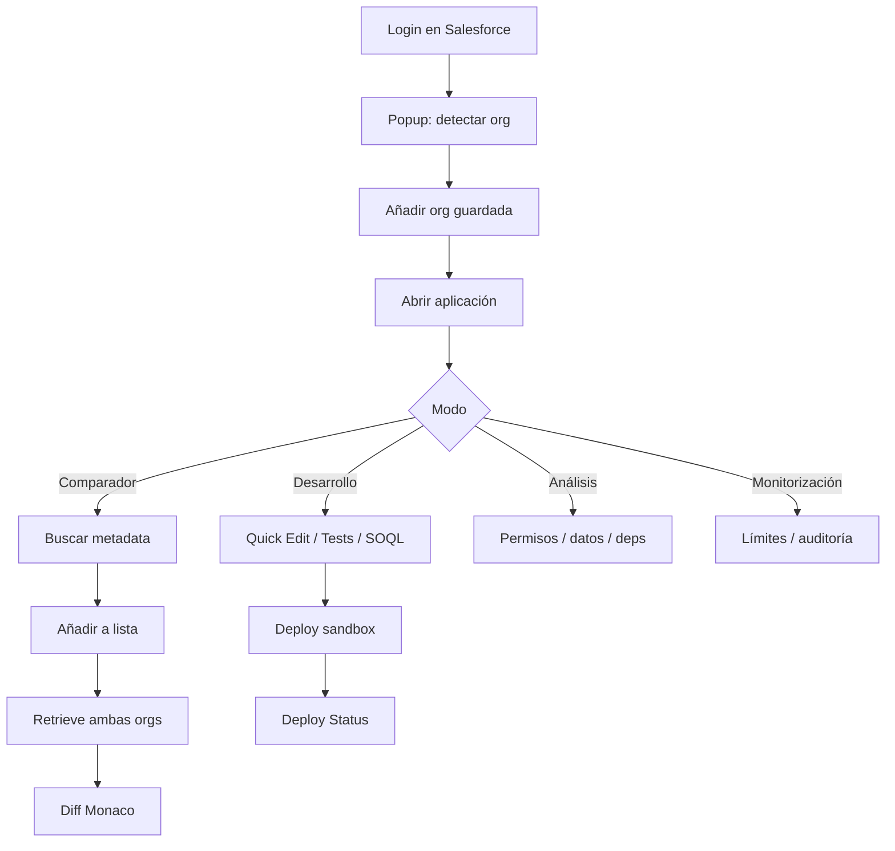
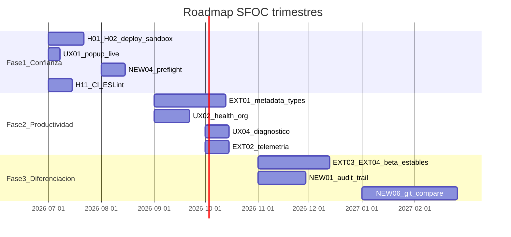

# Roadmap de funcionalidades y mejoras — Salesforce Org Compare

Documento de producto que consolida el inventario funcional actual, propuestas de mejora de usabilidad, extensiones de herramientas existentes, nuevas capacidades y priorización. Complementa — sin sustituir — la documentación operativa y de readiness ya existente.

**Audiencia:** equipo de desarrollo Contact Center CaixaBank, administradores Salesforce y stakeholders de producto.  
**Fecha:** junio 2026  
**Versión extensión:** manifest `2.12` · package.json `2.5.0` (desalineación pendiente)

### Documentación relacionada

| Documento | Contenido |
|-----------|-----------|
| [SFOC_FEATURE_CONTROLS.md](./SFOC_FEATURE_CONTROLS.md) | Kill switch remoto (`sfoc_feature_controls`) |
| [SFOC_POPUP_CONTROLS.md](./SFOC_POPUP_CONTROLS.md) | Avisos y bloqueos en popup |
| [SFOC_DEV_ADMIN_TOOLS.md](./SFOC_DEV_ADMIN_TOOLS.md) | Telemetría PostHog, operaciones y roadmap técnico |
| [production-readiness/](./production-readiness/) | Análisis pre-producción, riesgos P0–P3, plan de remediación |

---

## 1. Resumen ejecutivo

**Salesforce Org Compare (SFOC)** es una extensión Chrome Manifest V3 que permite a administradores y desarrolladores Salesforce comparar metadata y código entre orgs, ejecutar tests Apex, editar y desplegar en sandboxes, explorar dependencias, permisos y datos, y monitorizar límites y deploys — todo reutilizando la sesión del navegador (cookie `sid`), sin OAuth propio.

La extensión ya ofrece una suite amplia (~25 herramientas en 5 modos de navegación), editor Monaco con diff side-by-side, controles remotos vía PostHog EU y telemetría opt-out. Los principales gaps están en **seguridad operativa enterprise** (deploy a producción), **usabilidad discoverable** (atajos, progreso, health de org), **cobertura del comparador** (tipos metadata limitados) y **observabilidad homogénea** (9 herramientas sin telemetría).

### Top 10 recomendaciones priorizadas

| # | ID | Propuesta | Tipo | Prioridad |
|---|-----|-----------|------|-----------|
| 1 | H01 | Bloquear deploy a PROD en service worker + pre-flight con doble confirmación | Hardening + UX | P0 |
| 2 | H02 | Verificar `isSandbox` vía API al guardar/importar org | Hardening | P0 |
| 3 | UX01 | Popup controls en vivo (hook PostHog ya definido, no invocado) | UX + Ops | P1 |
| 4 | UX02 | Panel «Health de org» unificando Org Limits + Environment Status + latencia sesión | UX | P1 |
| 5 | EXT01 | Ampliar comparador: Flows, CustomObject, ValidationRule, EmailTemplate, StaticResource | Extensión | P1 |
| 6 | NEW01 | Audit trail local de acciones destructivas (deploy, import, borrar org) | Nueva | P1 |
| 7 | UX03 | Pre-flight de deploy con resumen de cambios antes de confirmar | UX | P1 |
| 8 | EXT02 | Instrumentar 9 herramientas sin `usage:log` | Extensión | P1 |
| 9 | UX04 | Panel Diagnóstico en Ajustes + informe de soporte copiable | UX | P1 |
| 10 | EXT03 | Salir de beta: DependencyExplorer (grafo) y RecordCompare (SOQL + diff) | Extensión | P2 |

---

## 2. Inventario funcional actual

### 2.1 Modos y herramientas

Definidos en [`code/core/constants.js`](../code/core/constants.js) y agrupados en UI por [`code/core/toolNavGroups.js`](../code/core/toolNavGroups.js).

| Modo | Herramienta | ID | Estado | Archivo principal |
|------|-------------|-----|--------|-------------------|
| **Comparador** | Búsqueda y diff metadata | — | Estable | [`code/ui/searchSetup.js`](../code/ui/searchSetup.js), [`code/editor/editorRender.js`](../code/editor/editorRender.js) |
| **Comparador** | Lista, pins, drag-and-drop | — | Estable | [`code/ui/listUi.js`](../code/ui/listUi.js) |
| **Comparador** | Quick Open (`Ctrl+Shift+P`) | — | Estable | [`code/ui/quickOpen.js`](../code/ui/quickOpen.js) |
| **Comparador** | Deep links | — | Estable | [`code/lib/compareDeepLink.js`](../code/lib/compareDeepLink.js) |
| **Desarrollo** | Ejecutar Tests Apex | `ApexTests` | Estable | [`code/ui/apexTestsPanel.js`](../code/ui/apexTestsPanel.js) |
| **Desarrollo** | Quick Edit (Apex) | `QuickEdit` | Estable | [`code/ui/quickEditPanel.js`](../code/ui/quickEditPanel.js) |
| **Desarrollo** | Lightning Quick Edit | `LightningQuickEdit` | Estable | [`code/ui/lightningQuickEditPanel.js`](../code/ui/lightningQuickEditPanel.js) |
| **Desarrollo** | Apex anónimo | `AnonymousApex` | Estable | [`code/ui/anonymousApexPanel.js`](../code/ui/anonymousApexPanel.js) |
| **Desarrollo** | Query Explorer | `QueryExplorer` | Estable | [`code/ui/queryExplorerPanel.js`](../code/ui/queryExplorerPanel.js) |
| **Desarrollo** | Debug Log Browser | `DebugLogBrowser` | Estable | [`code/ui/debugLogBrowserPanel.js`](../code/ui/debugLogBrowserPanel.js) |
| **Desarrollo** | Cobertura Apex compare | `ApexCoverageCompare` | Estable | [`code/ui/apexCoverageComparePanel.js`](../code/ui/apexCoverageComparePanel.js) |
| **Análisis** | Field Dependency | `FieldDependency` | Estable | [`code/ui/fieldDependencyPanel.js`](../code/ui/fieldDependencyPanel.js) |
| **Análisis** | Dependency Explorer | `DependencyExplorer` | **Beta** | [`code/ui/dependencyExplorerPanel.js`](../code/ui/dependencyExplorerPanel.js) |
| **Análisis** | Permission Diff | `PermissionDiff` | Estable | [`code/ui/permissionDiffPanel.js`](../code/ui/permissionDiffPanel.js) |
| **Análisis** | Custom Settings Compare | `CustomSettingsCompare` | Estable | [`code/ui/customSettingsComparePanel.js`](../code/ui/customSettingsComparePanel.js) |
| **Análisis** | Custom Metadata Compare | `CustomMetadataCompare` | Estable | [`code/ui/customMetadataComparePanel.js`](../code/ui/customMetadataComparePanel.js) |
| **Análisis** | Record Compare | `RecordCompare` | **Beta** | [`code/ui/recordComparePanel.js`](../code/ui/recordComparePanel.js) |
| **Monitorización** | Environment Status | `EnvironmentStatus` | Estable | [`code/ui/environmentStatusPanel.js`](../code/ui/environmentStatusPanel.js) |
| **Monitorización** | Org Limits | `OrgLimits` | Estable | [`code/ui/orgLimitsPanel.js`](../code/ui/orgLimitsPanel.js) |
| **Monitorización** | Deploy Status | `DeployStatus` | Estable | [`code/ui/deployStatusPanel.js`](../code/ui/deployStatusPanel.js) |
| **Monitorización** | Setup Audit Trail | `SetupAuditTrail` | Estable | [`code/ui/setupAuditTrailPanel.js`](../code/ui/setupAuditTrailPanel.js) |
| **Monitorización** | Field History | `FieldHistory` | Estable | [`code/ui/fieldHistoryPanel.js`](../code/ui/fieldHistoryPanel.js) |
| **Manifiestos** | Generar package.xml | `GeneratePackageXml` | Estable | [`code/ui/generatePackageXmlPanel.js`](../code/ui/generatePackageXmlPanel.js) |
| **Manifiestos** | Comparación por tipo | `MetadataTypeCompare` | Estable | [`code/ui/metadataTypeComparePanel.js`](../code/ui/metadataTypeComparePanel.js) |

**Visores independientes:** Apex Log Viewer ([`code/apex-log-viewer.html`](../code/apex-log-viewer.html)), Apex Coverage Viewer ([`code/apex-coverage-viewer.html`](../code/apex-coverage-viewer.html)).

**Popup y ajustes:** [`popup/popup.html`](../popup/popup.html), [`popup/settings.html`](../popup/settings.html).

Avisos beta en producción vía PostHog: [`shared/featureControlsProductionPayload.js`](../shared/featureControlsProductionPayload.js).

### 2.2 Tipos metadata en comparador

Definidos en [`code/lib/metadataSearch.js`](../code/lib/metadataSearch.js) (`METADATA_SEARCH_SPECS`):

| Tipo | artType | Bundle |
|------|---------|--------|
| Clases Apex | `ApexClass` | No |
| Triggers Apex | `ApexTrigger` | No |
| Páginas Visualforce | `ApexPage` | No |
| Componentes VF | `ApexComponent` | No |
| Lightning Web Components | `LWC` | Sí |
| Componentes Aura | `Aura` | Sí |
| Permission Sets | `PermissionSet` | No |
| Profiles | `Profile` | No |
| FlexiPages | `FlexiPage` | No |

Otros tipos pueden compararse vía retrieve/package.xml, pero **no aparecen en el buscador ni Quick Open**.

### 2.3 Flujos de usuario principales

1. **Onboarding:** login SF → popup detecta pestaña → añadir org → alias/grupo opcional → abrir Compare.
2. **Comparar clase Apex:** comparador → buscar → añadir lista → orgs L/R → retrieve → diff → exportar HTML o deep link.
3. **Quick Edit deploy:** desarrollo → Quick Edit → editar → deploy (UI bloquea PROD; SW no) → Deploy Status.
4. **Tests Apex:** ApexTests → seleccionar → ejecutar → hub polling → cobertura/log → Apex Log Viewer.
5. **Backup:** ajustes → exportar JSON → importar en otro navegador.

---

## 3. Mejoras de usabilidad

Propuestas organizadas por área. Cada ítem indica tipo **UX** y archivos de referencia.

### 3.1 Popup y onboarding

| ID | Mejora | Detalle | Archivos |
|----|--------|---------|----------|
| UX01 | Popup controls en vivo | `hookPopupControlsOnFeatureFlags()` existe en [`shared/posthogPopupControlsFlag.js`](../shared/posthogPopupControlsFlag.js) pero no se invoca desde [`popup/popup.js`](../popup/popup.js); hoy requiere reabrir popup | popup, posthogPopupControlsFlag |
| UX05 | Sesión expirada proactiva | Badge «expirada» antes de abrir Compare; CTA «Reautenticar» visible en popup cuando auth probe falla | [`popup/popup.js`](../popup/popup.js), [`background/orgHelpers.js`](../background/orgHelpers.js) |
| UX06 | Ayuda contextual por herramienta | Enlaces a runbooks Confluence / guías por panel desde [`code/ui/appHelp.js`](../code/ui/appHelp.js) | appHelp, i18n |
| UX07 | Onboarding por herramienta ampliado | Extender [`shared/onboardingPrefs.js`](../shared/onboardingPrefs.js) con tips por primera visita a Query Explorer, Permission Diff, etc. | onboardingPrefs, paneles UI |
| UX08 | Grupos de org visuales | Colapsar/expandir grupos en popup; contador de orgs caducadas por grupo | popup/popup.js |

### 3.2 Comparador

| ID | Mejora | Detalle | Archivos |
|----|--------|---------|----------|
| UX09 | Progreso retrieve unificado | Barra global «3/12 items» en retrieve multi-item en lugar de feedback solo por ítem | [`code/flows/retrieveFlow.js`](../code/flows/retrieveFlow.js), listUi |
| UX10 | Historial de comparaciones | Lista «recientes» además de pins (`pinnedKeys` en storage local) | [`code/core/persistence.js`](../code/core/persistence.js) |
| UX11 | Filtro por prefijo metadata | Filtrar buscador/lista por prefijos CaixaBank: `CC_`, `AM_`, `GRR_`, `HDT_`, `FRA_`, `SACH_` | searchSetup, listUi, metadataSearch |
| UX12 | Aviso 2000+ filas mejorado | Mensaje actual en i18n es genérico; añadir acción «exportar CSV parcial» o «refinar SOQL» | [`shared/i18n.js`](../shared/i18n.js), setupRecordsComparePanelCommon |
| UX13 | Diff navegación mejorada | Mini-mapa de cambios en ficheros grandes; contador «cambio 4 de 23» más visible | [`code/editor/editorRender.js`](../code/editor/editorRender.js) |
| UX14 | Comparación por namespace | Filtro `namespacePrefix` en MetadataTypeCompare y buscador | metadataTypeComparePanel, metadataSearch |

### 3.3 Editor y Quick Edit

| ID | Mejora | Detalle | Archivos |
|----|--------|---------|----------|
| UX03 | Pre-flight de deploy | Modal: org destino, sandbox/prod, número de clases/ficheros, diff resumido, confirmación extra en PROD | quickEditPanel, lightningQuickEditPanel |
| UX15 | Atajos documentados | Panel «?» o footer con atajos Monaco (buscar, reemplazar, formatear) | [`code/editor/monacoWorkbench.js`](../code/editor/monacoWorkbench.js), vscodeTabs |
| UX16 | Recuperación sesión SW | Tras crash MV3 del service worker, restaurar tabs dirty desde [`code/lib/codeEditorSession.js`](../code/lib/codeEditorSession.js) | codeEditorSession, monacoWorkbench |
| UX17 | Indicador org destino persistente | Chip siempre visible: «Desplegando a: UAT-CC (sandbox)» | codeEditorToolbar |
| UX18 | Validación antes de cerrar tab | Confirmación si tab tiene cambios sin guardar (parcialmente en vscodeTabs) | [`code/ui/vscodeTabs.js`](../code/ui/vscodeTabs.js) |

### 3.4 Desarrollo

| ID | Mejora | Detalle | Archivos |
|----|--------|---------|----------|
| UX19 | Query Explorer: tags y export | Consultas guardadas con etiquetas; export CSV/JSON de resultados SOQL | queryExplorerPanel |
| UX20 | Debug Log Browser: filtros | Por usuario, rango fecha, operación; botón «Abrir en Apex Log Viewer» | debugLogBrowserPanel, apex-log-viewer |
| UX21 | ApexTests: diff entre runs | Comparar cobertura/resultados de dos ejecuciones del hub | apexTestsHubRuns, apexTestsPanel |
| UX22 | ApexTests: export informe | HTML/PDF con resumen clases, métodos fallidos, cobertura | apexTestsExport |
| UX23 | Anonymous Apex: plantillas | Galería de scripts frecuentes además de tabs guardados en localStorage | anonymousApexPanel |
| UX24 | Notificación deploy completado | Igual que tests Apex: [`chrome.notifications`](../manifest.json) al terminar deploy | deployStatusPanel, messageHandlers |

### 3.5 Análisis

| ID | Mejora | Detalle | Archivos |
|----|--------|---------|----------|
| UX25 | Permission Diff: vista ejecutiva | Toggle «solo diferencias» + export CSV para auditorías internas | permissionDiffPanel, permissionsDiffCore |
| UX26 | RecordCompare: diff campo a campo | Highlight de campos distintos entre registros (beta → estable) | recordComparePanel, recordCompareCore |
| UX27 | Custom Settings: diff visual | Tabla side-by-side con celdas coloreadas (hoy es listado comparativo) | customSettingsComparePanel |
| UX28 | Field Dependency: export | Exportar árbol picklist dependiente a CSV/JSON | fieldDependencyPanel |

### 3.6 Monitorización

| ID | Mejora | Detalle | Archivos |
|----|--------|---------|----------|
| UX02 | Health de org unificado | Combinar Org Limits + Environment Status + probe latencia API + versión API + estado sesión | orgLimitsPanel, environmentStatusPanel, trustStatusApi |
| UX29 | Setup Audit Trail: filtro prefijo | Filtrar entradas por prefijo metadata (`CC_`, `HDT_`, etc.) — útil en orgs multi-equipo CaixaBank | setupAuditTrailPanel |
| UX30 | Deploy Status: enlace diff | Abrir diff del componente desplegado directamente en comparador | deployStatusPanel, compareDeepLink |
| UX31 | Field History: presets | Consultas frecuentes guardadas (objeto + campos tracking) | fieldHistoryPanel |

### 3.7 Ajustes y privacidad

| ID | Mejora | Detalle | Archivos |
|----|--------|---------|----------|
| UX04 | Panel Diagnóstico | Versión manifest, install_id truncado, estado flags PostHog, copiar informe soporte JSON | popup/settings.js, extensionSettings |
| UX32 | Changelog post-update | Modal tras `extension_updated` con novedades (flag PostHog o JSON en web) | extensionLifecycleTelemetry, onboardingPrefs |
| UX33 | Centro de privacidad | Qué se envía / nunca se envía; enlace política; rotar install_id | settings, i18n, extensionSettings |
| UX34 | Backup: vista previa import | Mostrar diff de orgs/items antes de sobrescribir configuración | popup/settings.js |

---

## 4. Extensiones a funcionalidades existentes

Mejoras que **amplían** capacidades ya presentes sin crear herramientas nuevas de cero.

| ID | Feature actual | Extensión propuesta | Esfuerzo | Archivos |
|----|----------------|---------------------|----------|----------|
| EXT01 | Comparador (9 tipos) | Añadir 15+ tipos: Flow, CustomObject, ValidationRule, EmailTemplate, StaticResource, Layout, CustomField, WorkflowRule, AssignmentRule, Queue, Group, RemoteSiteSetting, NamedCredential, CustomLabel, Report | L | metadataSearch.js, retrieveFlow.js, METADATA_SEARCH_SPECS |
| EXT02 | Telemetría | Instrumentar 9 herramientas sin `usage:log` (ver apéndice A) | M | paneles respectivos, usageLogEntry |
| EXT03 | DependencyExplorer (beta) | Grafo visual de dependencias; profundidad configurable; export CSV ampliado | M | dependencyExplorerPanel, dependencyExplorer.js |
| EXT04 | RecordCompare (beta) | Comparación por criterio SOQL (WHERE), no solo Id; paginación >2000 | M | recordComparePanel, recordCompareCore |
| EXT05 | Quick Open | Comandos recientes; acciones globales (swap orgs, export diff, ir a Deploy Status) | S | quickOpen.js |
| EXT06 | Backup JSON | Incluir audit trail local, consultas Query Explorer, historial comparaciones | M | settings.js, extensionSettings.js |
| EXT07 | Deep links | Compartir estado Quick Edit / Anonymous Apex (tab + org) además de compare | M | compareDeepLink.js, codeEditorSession.js |
| EXT08 | Feature controls | Mostrar `modes.message` en UI; `minExtensionVersion`; refresh flags al foco | S–M | featureControlsUi.js, featureControls.js, posthogFeatureFlagLoader |
| EXT09 | MetadataTypeCompare | Diff side-by-side por miembro seleccionado (hoy es listado diff/no-diff) | M | metadataTypeComparePanel, metadataTypeCompareCore |
| EXT10 | GeneratePackageXml | Plantillas package.xml guardadas (full, delta CC_, subset permisos) | S | generatePackageXmlPanel |
| EXT11 | Apex Log Viewer | Enlace desde Debug Log Browser y ApexTests con línea preseleccionada | S | debugLogBrowserPanel, apex-log-viewer.js |
| EXT12 | i18n ES/EN | Completar strings de error del service worker; tooltips onboarding faltantes | M | i18n.js, messageHandlers.js |
| EXT13 | Monaco themes | Temas adicionales alineados con Salesforce Lightning Design System | S | monaco.js, extensionSettings |
| EXT14 | ApexTests hub | Perfiles de ejecución compartibles entre orgs vía backup JSON | S | apexTestRunProfilesStorage.js |
| EXT15 | Permission Diff | Comparar Permission Set Group y Muting Permission Sets | M | permissionsDiffApi.js, permissionsDiffCore.js |
| EXT16 | Org groups | Sincronizar color/icono por grupo en popup y selectores Compare | S | orgPrefs.js, orgs.js |
| EXT17 | Feature controls doc | Actualizar [`SFOC_FEATURE_CONTROLS.md`](./SFOC_FEATURE_CONTROLS.md) con modo `analysis` y herramientas EnvironmentStatus, DeployStatus, MetadataTypeCompare | S | docs |

### 4.1 Tipos metadata candidatos para EXT01

Priorizados para contexto Contact Center CaixaBank:

| Prioridad | Tipo metadata | Valor CC |
|-----------|---------------|----------|
| Alta | Flow, FlowDefinition | Automatizaciones CC_/HDT_ |
| Alta | CustomObject, CustomField | Modelo de datos omnicanal |
| Alta | ValidationRule | Reglas de negocio |
| Media | EmailTemplate, Letterhead | Comunicaciones |
| Media | Layout, CompactLayout | UX agente |
| Media | StaticResource | Assets LWC/VF |
| Media | RemoteSiteSetting, NamedCredential | Integraciones telefonía/Genesys |
| Baja | Report, Dashboard | Analítica operativa |
| Baja | ExperienceBundle | Portales (largo plazo) |

---

## 5. Nuevas funcionalidades propuestas

Capacidades **nuevas** que no existen hoy en la extensión.

### 5.1 Alta prioridad (valor operativo enterprise)

| ID | Funcionalidad | Descripción | Esfuerzo |
|----|---------------|-------------|----------|
| NEW01 | Audit trail local | Registro local (JSON/CSV): deploy, validate, import backup replace, borrar org, anonymous apex execute. Exportable para compliance | M |
| NEW02 | Modo solo lectura por org | Flag por org: compare/retrieve sí; deploy/anonymous apex no. Enforcement en SW | M |
| NEW03 | Allowlist de orgs | Solo instanceUrl autorizadas pueden añadirse (política enterprise CaixaBank) | M |
| NEW04 | Pre-flight PROD reforzado | Doble confirmación escrita («DEPLOY») + bloqueo SW (ver H01) | S |
| NEW05 | Política deploy por org | Config: «esta org requiere validate-only» o «bloquear anonymous apex» | M |

### 5.2 Prioridad media

| ID | Funcionalidad | Descripción | Esfuerzo |
|----|---------------|-------------|----------|
| NEW06 | Comparador org vs Git | Diff metadata local (SF CLI retrieve) vs org remota | L |
| NEW07 | Flow / Process Builder diff | Comparador dedicado de definiciones Flow (XML/JSON) | M |
| NEW08 | Page Layout compare | Extender más allá de FlexiPage a layouts clásicos | M |
| NEW09 | Scheduler tests Apex | Ejecución recurrente con alarm + notificación | M |
| NEW10 | Email Template compare | Diff HTML/texto entre orgs | M |
| NEW11 | Static Resource compare | Diff binario/texto con preview imagen | M |
| NEW12 | Cola trabajos largos | Retrieve masivo / MetadataTypeCompare en background con notificación | M |
| NEW13 | Comparador Permission Set Group | Diff de agrupaciones de permisos | M |

### 5.3 Largo plazo

| ID | Funcionalidad | Descripción | Esfuerzo |
|----|---------------|-------------|----------|
| NEW14 | Content script Lightning | Botón «Abrir en SFOC» desde Setup / Developer Console | L |
| NEW15 | Backup cifrado | Export/import con passphrase (sin cloud) | M |
| NEW16 | Integración ServiceNow/Jira | Crear ticket desde informe de soporte | M |
| NEW17 | Experience Cloud compare | Sites, Network, ExperienceBundle | L |
| NEW18 | Comparador Genesys eventos | Metadata CC_ telefonía (Flows + Custom Objects específicos) | L |
| NEW19 | SF CLI wrapper | Invocar retrieve/deploy CLI desde UI con output en panel | L |
| NEW20 | Multi-usuario org notes | Notas locales por org («UAT bloqueada hasta viernes») | S |

---

## 6. Hardening y calidad enterprise

Deuda técnica prioritaria consolidada desde [`production-readiness/06-plan-remediacion.md`](./production-readiness/06-plan-remediacion.md) y [`03-riesgos-criticos-codigo.md`](./production-readiness/03-riesgos-criticos-codigo.md).

| ID | Mejora | Problema | Impacto | Archivos | Prioridad |
|----|--------|----------|---------|----------|-----------|
| H01 | Guard deploy PROD en SW | Deploy bloqueado solo en UI Quick Edit | Crítico — deploy accidental | [`background/messageHandlers.js`](../background/messageHandlers.js) | P0 |
| H02 | Verificar `isSandbox` vía API | Flag manipulable al importar JSON | Crítico — UI engañosa | messageHandlers.js, orgHelpers.js | P0 |
| H03 | Feature controls en lectura | `fetchSource`, `searchIndex`, `quickOpen:buildIndex` sin check `retrieve` | Kill switch incompleto | messageHandlers.js | P1 |
| H04 | Popup controls en vivo | Hook definido, no invocado | Ops en incidentes | popup/popup.js | P1 |
| H05 | Opt-out en `$exception` | Errores enviados aunque telemetría OFF | Privacidad / GDPR | posthogException.js | P1 |
| H06 | Kill switch deleteAll logs | `debugLogs:deleteAll` sin feature control | Ops | messageHandlers.js | P1 |
| H07 | XSS innerHTML | SEC-04/05 en dependency explorer y log viewer | Seguridad | dependencyExplorerPanel, apex-log-viewer | P2 |
| H08 | Sanitizar errores deploy | Mensajes API sin sanitizar en UI | Seguridad | messageHandlers.js | P2 |
| H09 | Alinear versiones | manifest `2.12` vs package `2.5.0` | Release / soporte | manifest.json, package.json | P2 |
| H10 | Advertencia storage código | Metadata en localStorage sin cifrar (SEC-03) | Privacidad | persistence.js, settings | P3 |
| H11 | CI GitHub Actions | Tests + pack en cada PR | Calidad | .github/workflows | P0 |
| H12 | E2E smoke extensión | Playwright: popup carga, SW responde | Regresiones | tests/e2e | P1 |
| H13 | ESLint reglas extensión | CSP, chrome.* APIs | Calidad | eslint config | P0 |
| H14 | Async hardening SW | Promesas no awaited, LRU cachés | Estabilidad MV3 | messageHandlers, caches | P2 |

Veredicto readiness: **apto con reservas** para enterprise — [`production-readiness/README.md`](./production-readiness/README.md).

---

## 7. Matriz de priorización unificada

Combina IDs de [`SFOC_DEV_ADMIN_TOOLS.md`](./SFOC_DEV_ADMIN_TOOLS.md) (R01–R22, C01–C06) con propuestas UX/EXT/NEW/H de este documento.

| ID | Propuesta | Categoría | Esfuerzo | Valor usuario | Prioridad |
|----|-----------|-----------|----------|---------------|-----------|
| H01 | Guard deploy PROD en SW | Hardening | S | Crítico | P0 |
| H02 | Verificar isSandbox API | Hardening | S | Crítico | P0 |
| H11 | CI GitHub Actions | Ops | M | Alto | P0 |
| H13 | ESLint | Ops | S | Medio | P0 |
| R01 | Restaurar scripts PostHog faltantes | Ops | M | Medio | P0 |
| R02 | Runbooks TELEMETRY + INCIDENT | Ops | S | Alto | P0 |
| R04 | minExtensionVersion | Extensión | S | Alto | P0 |
| R05 | Refresh flags al foco | Extensión | S | Medio | P0 |
| R07 | Override flags QA | Extensión | S | Medio | P0 |
| C01 | Alinear versiones manifest/package | Ops | S | Medio | P0 |
| NEW04 | Pre-flight PROD reforzado | Nueva | S | Crítico | P0 |
| UX03 | Pre-flight deploy UX | UX | M | Alto | P1 |
| UX01 | Popup controls en vivo | UX | S | Medio | P1 |
| UX02 | Health de org unificado | UX | M | Alto | P1 |
| UX04 | Panel Diagnóstico | UX | M | Alto | P1 |
| UX32 | Changelog post-update | UX | M | Medio | P1 |
| UX33 | Centro privacidad | UX | S | Medio | P1 |
| EXT01 | +15 tipos metadata comparador | Extensión | L | Alto | P1 |
| EXT02 | Instrumentar 9 herramientas | Extensión | M | Medio (equipo) | P1 |
| EXT08 | modes.message + minVersion UI | Extensión | S | Medio | P1 |
| NEW01 | Audit trail local | Nueva | M | Alto | P1 |
| NEW02 | Modo solo lectura por org | Nueva | M | Alto | P1 |
| H03 | Feature controls lectura SW | Hardening | M | Alto (ops) | P1 |
| H05 | Opt-out excepciones | Hardening | S | Alto (legal) | P1 |
| H06 | Kill switch deleteAll | Hardening | S | Medio | P1 |
| H12 | E2E smoke | Ops | L | Alto | P1 |
| R08 | Dashboard adopción PostHog | Ops | M | Medio | P1 |
| R12 | duration_ms en usage:log | Extensión | M | Medio | P1 |
| R13 | (= EXT02) | Extensión | M | Medio | P1 |
| UX09 | Progreso retrieve unificado | UX | S | Medio | P2 |
| UX11 | Filtro prefijos CC_/AM_/… | UX | S | Alto (CC) | P2 |
| UX19 | Query Explorer tags/export | UX | M | Medio | P2 |
| UX24 | Notificación deploy | UX | S | Medio | P2 |
| UX25 | Permission Diff ejecutivo | UX | M | Alto (CC) | P2 |
| UX29 | Audit Trail filtro prefijo | UX | S | Alto (CC) | P2 |
| EXT03 | DependencyExplorer grafo | Extensión | M | Alto | P2 |
| EXT04 | RecordCompare SOQL | Extensión | M | Alto | P2 |
| EXT09 | MetadataTypeCompare diff | Extensión | M | Medio | P2 |
| NEW03 | Allowlist orgs | Nueva | M | Alto (enterprise) | P2 |
| NEW06 | Comparador org vs Git | Nueva | L | Alto | P2 |
| NEW07 | Flow diff | Nueva | M | Alto | P2 |
| H07 | XSS fixes | Hardening | S | Medio | P2 |
| R14 | Ring buffer eventos local | Extensión | M | Medio | P2 |
| R17 | (= UX02 ampliado) | UX | M | Alto | P2 |
| R18 | (= NEW01 parcial) | Nueva | M | Alto | P2 |
| UX15 | Atajos documentados | UX | S | Bajo | P3 |
| NEW14 | Content script Lightning | Nueva | L | Alto | P3 |
| NEW16 | Integración Jira/ServiceNow | Nueva | M | Medio | P3 |
| R20 | Experimentos A/B UX | Extensión | L | Medio | P3 |
| R21 | Status page pública | Ops | M | Medio | P3 |

**Leyenda esfuerzo:** S = horas–2 días · M = 1–2 semanas · L = varias semanas.

---

## 8. Roadmap por fases

### Fase 1 — Confianza y base (1–2 sprints)

**Objetivo:** desplegar con seguridad en entorno enterprise CaixaBank.

- H01, H02, NEW04, UX03 (deploy seguro end-to-end)
- UX01 (popup controls en vivo)
- H11, H13, C01 (CI, ESLint, versiones alineadas)
- R01, R02, R04, R05, R07 (infra PostHog y QA)

**Criterio de éxito:** imposible deploy accidental a PROD vía SW; `isSandbox` verificado por API.

### Fase 2 — Productividad (2–3 sprints)

**Objetivo:** reducir fricción diaria del desarrollador CC.

- EXT01 (tipos metadata: Flow, CustomObject, ValidationRule prioritarios)
- UX02, UX11, UX29 (health org + filtros prefijos CaixaBank)
- UX04, UX32, UX33 (diagnóstico, changelog, privacidad)
- EXT02 / R13 (telemetría completa)
- EXT08 (feature controls UI mejorado)

**Criterio de éxito:** comparar Flows CC_ entre UAT y PROD desde buscador; dashboard adopción cubre 100 % herramientas.

### Fase 3 — Diferenciación (continuo)

**Objetivo:** herramientas beta estables e integraciones internas.

- EXT03, EXT04 (DependencyExplorer y RecordCompare fuera de beta)
- NEW01, NEW02, NEW03 (audit trail, solo lectura, allowlist)
- NEW06, NEW07 (Git compare, Flow diff)
- NEW16 (ServiceNow/Jira desde informe soporte)
- NEW14 (content script Lightning — evaluar permisos MV3)

**Criterio de éxito:** RecordCompare usable en comparaciones de datos CC_ por SOQL; audit trail exportable para compliance.

---

## 9. Apéndices

### Apéndice A — Mapa herramienta → telemetría

Pipeline: UI → [`code/core/bridge.js`](../code/core/bridge.js) → [`background/usageLog.js`](../background/usageLog.js) → PostHog (`comparison_run` / `extension_usage`). Detalle en [`SFOC_DEV_ADMIN_TOOLS.md` § Apéndice A](./SFOC_DEV_ADMIN_TOOLS.md).

| Herramienta | `usage:log` | Evento PostHog | Archivo emisor |
|-------------|-------------|----------------|----------------|
| Comparador (render diff) | Sí | `comparison_run` | editorRender.js |
| Comparador (retrieve) | Sí | `comparison_run` | retrieveFlow.js |
| ApexTests | Sí | `comparison_run` | apexTestUsageLog.js |
| QuickEdit | Sí | `comparison_run` | quickEditPanel.js |
| LightningQuickEdit | Sí | `comparison_run` | lightningQuickEditPanel.js |
| AnonymousApex | Sí | `comparison_run` | anonymousApexPanel.js |
| DependencyExplorer | Sí | `comparison_run` | dependencyExplorerPanel.js |
| FieldDependency | Sí | `comparison_run` | fieldDependencyPanel.js |
| FieldHistory | Sí | `comparison_run` | fieldHistoryPanel.js |
| PermissionDiff | Sí | `comparison_run` | permissionDiffPanel.js |
| CustomSettingsCompare | Sí | `comparison_run` | setupRecordsComparePanelCommon.js |
| CustomMetadataCompare | Sí | `comparison_run` | setupRecordsComparePanelCommon.js |
| GeneratePackageXml | Sí | `comparison_run` | generatePackageXmlPanel.js |
| **QueryExplorer** | **No** | — | queryExplorerPanel.js |
| **DebugLogBrowser** | **No** | — | debugLogBrowserPanel.js |
| **ApexCoverageCompare** | **No** | — | apexCoverageComparePanel.js |
| **OrgLimits** | **No** | — | orgLimitsPanel.js |
| **SetupAuditTrail** | **No** | — | setupAuditTrailPanel.js |
| **EnvironmentStatus** | **No** | — | environmentStatusPanel.js |
| **DeployStatus** | **No** | — | deployStatusPanel.js |
| **RecordCompare** | **No** | — | recordComparePanel.js |
| **MetadataTypeCompare** | **No** | — | metadataTypeComparePanel.js |

### Apéndice B — Glosario de IDs de herramientas

Referencia [`code/core/constants.js`](../code/core/constants.js) y [`shared/featureControls.js`](../shared/featureControls.js):

| ID | Modo | Grupo UI |
|----|------|----------|
| `ApexTests` | development | tests |
| `ApexCoverageCompare` | development | tests |
| `QuickEdit` | development | apexCode |
| `LightningQuickEdit` | development | apexCode |
| `AnonymousApex` | development | apexCode |
| `QueryExplorer` | development | inspect |
| `DebugLogBrowser` | development | inspect |
| `FieldDependency` | analysis | dependencies |
| `DependencyExplorer` | analysis | dependencies |
| `PermissionDiff` | analysis | permissions |
| `CustomSettingsCompare` | analysis | dataCompare |
| `CustomMetadataCompare` | analysis | dataCompare |
| `RecordCompare` | analysis | dataCompare |
| `EnvironmentStatus` | monitoring | orgHealth |
| `OrgLimits` | monitoring | orgHealth |
| `DeployStatus` | monitoring | orgHealth |
| `SetupAuditTrail` | monitoring | audit |
| `FieldHistory` | monitoring | audit |
| `GeneratePackageXml` | manifests | — |
| `MetadataTypeCompare` | manifests | — |

Modos feature control: `comparator`, `development`, `analysis`, `monitoring`, `manifests`.

Acciones feature control: `deploy`, `retrieve`, `compare_run`, `apex_test_run`, `anonymous_apex_execute`, `quick_edit_save`.

### Apéndice C — Prefijos metadata CaixaBank

Cuando el contexto operativo lo requiera, las mejoras de filtrado (UX11, UX29, EXT10) deben contemplar estos prefijos de proyectos Contact Center:

| Prefijo | Ámbito |
|---------|--------|
| `CC_` | Contact Center (core) |
| `AM_` | Asset Management / proyectos AM |
| `GRR_` | GRR |
| `HDT_` | HDT |
| `FRA_` | FRA |
| `SACH_` | SACH |

### Apéndice D — Referencias cruzadas por tema

| Tema | Documento | Sección |
|------|-----------|---------|
| Kill switch remoto | [SFOC_FEATURE_CONTROLS.md](./SFOC_FEATURE_CONTROLS.md) | Payload v1, acciones, modos |
| Popup remoto | [SFOC_POPUP_CONTROLS.md](./SFOC_POPUP_CONTROLS.md) | notice, openApp |
| Telemetría y dashboards | [SFOC_DEV_ADMIN_TOOLS.md](./SFOC_DEV_ADMIN_TOOLS.md) | §3–5, Apéndice A |
| Riesgos P0 deploy | [03-riesgos-criticos-codigo.md](./production-readiness/03-riesgos-criticos-codigo.md) | P0-1, P0-2 |
| Plan remediación | [06-plan-remediacion.md](./production-readiness/06-plan-remediacion.md) | Tabla priorizada |
| Seguridad SEC-* | [02-seguridad-y-privacidad.md](./production-readiness/02-seguridad-y-privacidad.md) | SEC-01 a SEC-08 |
| Arquitectura MV3 | [01-arquitectura-y-funcionalidades.md](./production-readiness/01-arquitectura-y-funcionalidades.md) | Inventario completo |
| Tests y CI | [05-testing-ci-y-operaciones.md](./production-readiness/05-testing-ci-y-operaciones.md) | Cobertura Vitest |

### Apéndice E — Conteo de propuestas

| Categoría | Cantidad |
|-----------|----------|
| Mejoras UX (UX01–UX34) | 34 |
| Extensiones (EXT01–EXT17) | 17 |
| Nuevas funcionalidades (NEW01–NEW20) | 20 |
| Hardening (H01–H14) | 14 |
| Ops heredadas R/C (referenciadas) | 22 |
| **Total propuestas únicas** | **~85 referencias** (con solapamiento intencional en matriz) |

---

*Documento generado a partir del análisis del codebase y documentación existente. Para implementación, crear PRs dedicados por ID de priorización. No modifica código; es guía de producto y planificación.*
