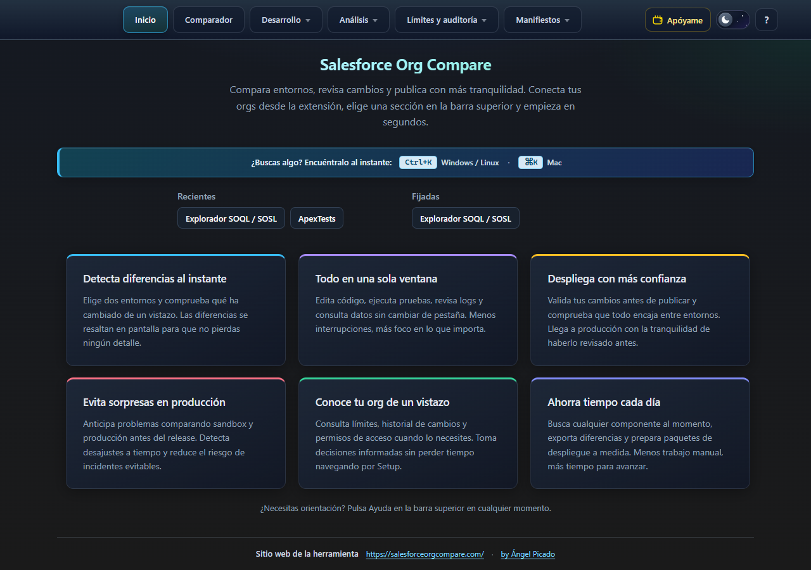
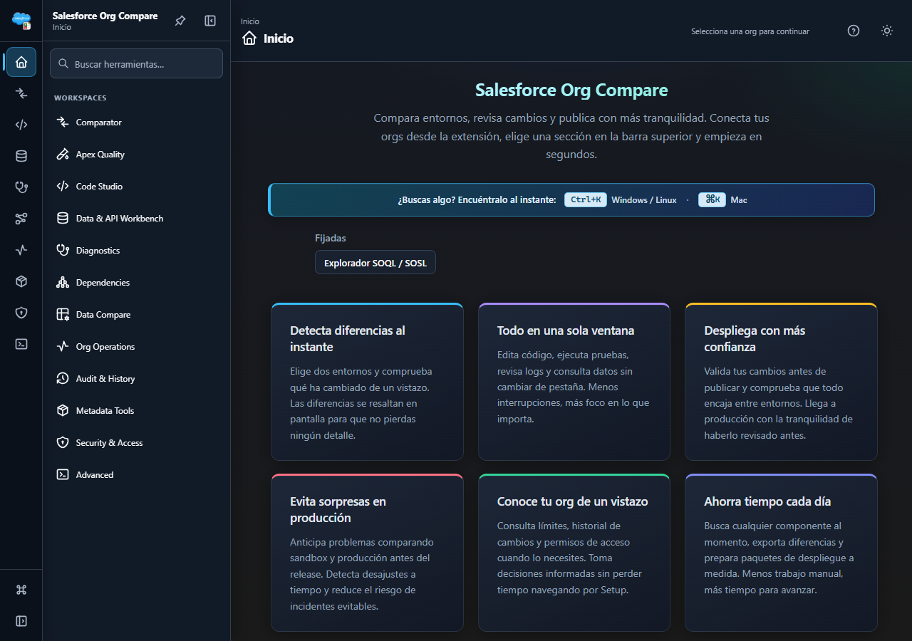
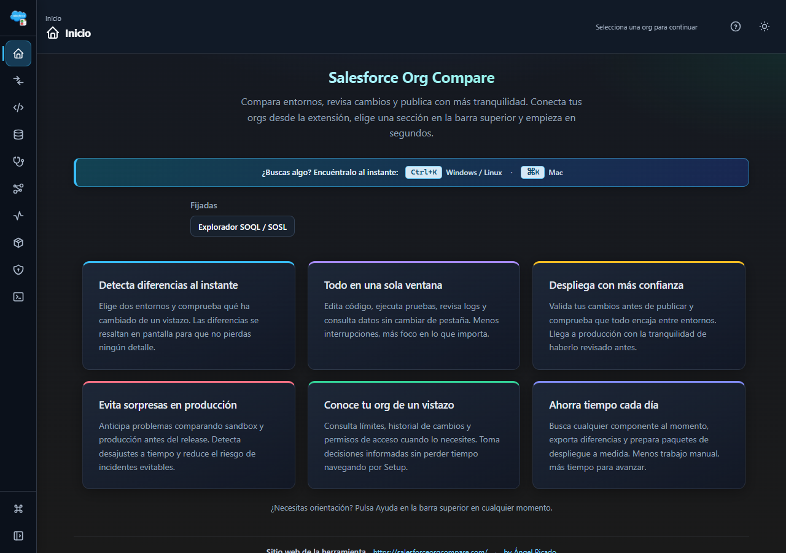
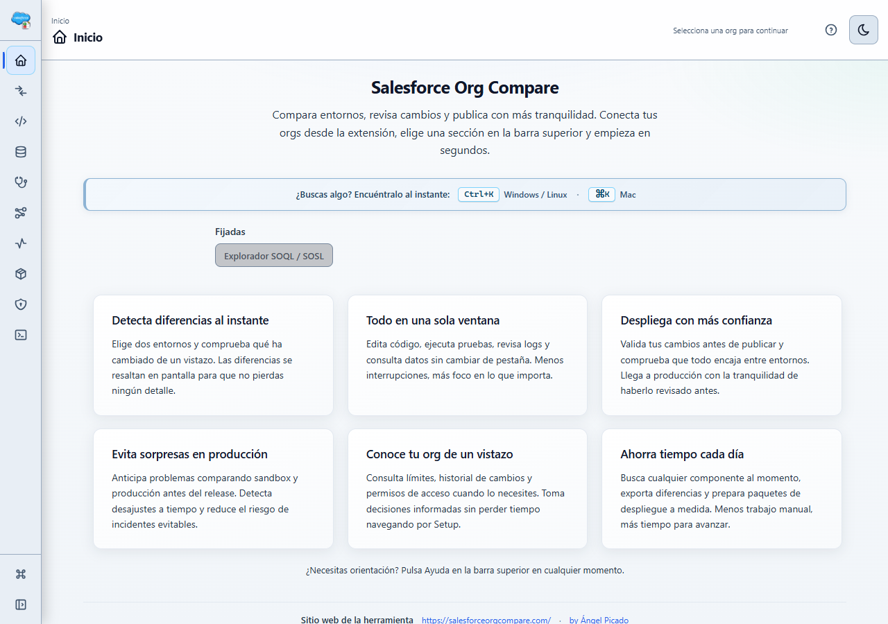
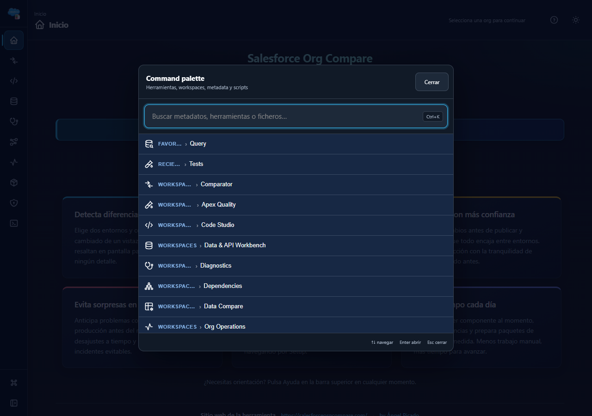
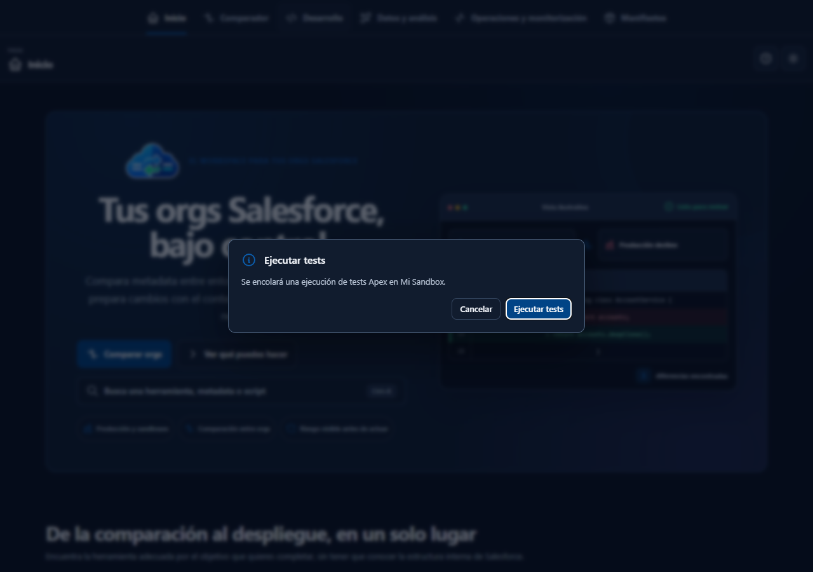
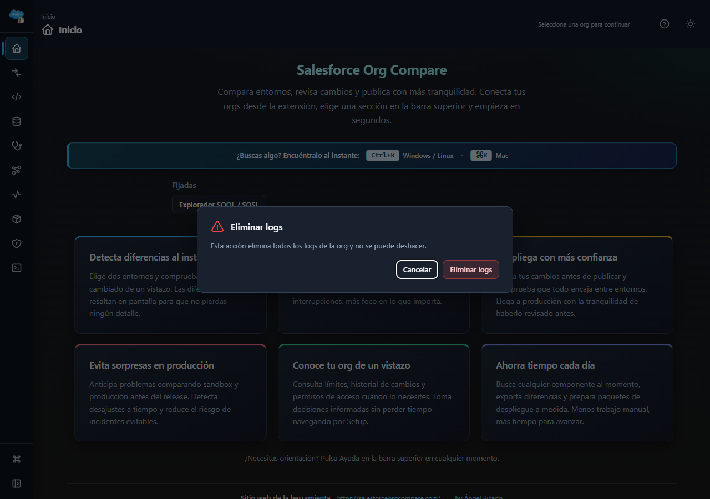

# UI 2.0 Workbench: arquitectura, migración y validación

Fecha de cierre: 2026-08-19. Rama: `feature/code-ui-v2`. Base: `main@650d7de`.

## 1. Resultado y diagnóstico de la navegación Classic

Classic concentra la navegación en menús superiores, conserva el Tool ID activo en `#typeSelect` y mantiene los paneles de herramienta montados en `code.html`. Las rutas se resuelven con `nav` y `op`; `compareDeepLink.js` completa el estado del Comparator y `appHistoryNavigation.js` restaura atrás/adelante. Quick Open ya ofrecía herramientas, metadata y scripts mediante `Ctrl/Cmd+Shift+P`; recientes y fijadas ya se guardaban en `chrome.storage.local`.

UI 2.0 añade una capa Workbench sobre esos contratos, no otra aplicación:

- Rail permanente de 60 px con diez categorías, estado seleccionado con icono, borde, texto accesible y `aria-current`.
- Panel de 264 px expandible y fijable, dedicado únicamente a búsqueda y workspaces de la categoría. Favoritas permanecen en Inicio y en la command palette; “Última herramienta” y “Recientes” no se presentan en los menús V2 y el bloque de recientes tampoco se monta en su Inicio.
- Cabecera contextual con breadcrumb, herramienta, tabs, orgs, entorno, solo lectura, riesgo, acciones proxy, ayuda y tema.
- Command palette con `Ctrl/Cmd+K`; `Ctrl/Cmd+Shift+P` sigue siendo compatible.
- Los paneles existentes permanecen montados. Los adaptadores seleccionan vistas internas existentes y conservan filtros, scroll y editores.
- Classic continúa siendo el valor por defecto. `sfocUiMode` elige la capa de navegación en la siguiente apertura.

El inventario y las medidas anteriores a la implementación están en [UI_V2_BASELINE.md](./UI_V2_BASELINE.md).

## 2. Wireframes implementados

### Inicio

```text
┌──────┬────────────────────────┬──────────────────────────────────────────────┐
│ RAIL │ Salesforce Org Compare │ Inicio                         Ayuda  Tema   │
│ ● 🏠 │ Buscar herramientas…   ├──────────────────────────────────────────────┤
│   ⇄  │                        │ Salesforce Org Compare                       │
│   </>│ Workspaces             │ [ Ctrl/Cmd+K Buscar cualquier herramienta ] │
│   DB │                        │                                              │
│   …  │                        │ Recientes             Fijadas               │
│      │                        │ ┌ Seguridad ┐ ┌ Productividad ┐ ┌ Estado ┐ │
└──────┴────────────────────────┴──────────────────────────────────────────────┘
```

### Workspace

```text
┌──────┬────────────────────────┬──────────────────────────────────────────────┐
│ RAIL │ Desarrollo             │ Desarrollo / Apex Quality                  │
│      │ Apex Quality           │ [icono] Apex Quality [ORG] [SANDBOX]       │
│      │ Code Studio            │                    Ayuda  Tema              │
│      │                        ├──────────────────────────────────────────────┤
│      │                        │ Tests | Ejecuciones | Resultados | Cobertura│
│      │                        ├──────────────────────────────────────────────┤
│      │                        │ Panel existente, sin clonar handlers        │
└──────┴────────────────────────┴──────────────────────────────────────────────┘
```

### Rail expandido, colapsado y reflow

```text
Expandido  [rail 60] [panel 264 · fijar/cerrar] [workspace]
Colapsado  [rail 60]                            [workspace]
Compacto   [rail 60] [drawer superpuesto + backdrop] [workspace sin comprimir]
```

El modo compacto se activa por media query a 1100 px. La prueba automatizada usa 640 CSS px como equivalente de un viewport de 1280 px al 200 %.

### Command palette

```text
┌──────────────────────────────────────────────────────────────┐
│ Command palette                                      Cerrar │
│ Herramientas, workspaces, metadata y scripts                │
├──────────────────────────────────────────────────────────────┤
│ 🔍 Buscar metadatos, herramientas o ficheros…      Ctrl+K   │
├──────────────────────────────────────────────────────────────┤
│ ★ FAVORITAS   › Query                        Data & API       │
│ ↻ RECIENTES   › Tests                        Apex Quality     │
│ ⇄ WORKSPACES  › Comparator                                    │
│ 🔒 Bloqueada — explicación del feature control              │
├──────────────────────────────────────────────────────────────┤
│ ↑↓ navegar             Enter abrir              Esc cerrar  │
└──────────────────────────────────────────────────────────────┘
```

Implementa combobox/listbox, flechas, Enter, Escape, `aria-activedescendant`, focus trap y restauración del foco. Los elementos ocultos por feature controls no se incluyen; los bloqueados explican el motivo mediante `aria-disabled`.

### Modal estándar

```text
┌──────────────────────────────────────────┐
│ ℹ Ejecutar tests                        │
│ Se ejecutará la selección actual.       │
│                    [Cancelar] [Ejecutar]│
└──────────────────────────────────────────┘
```

### Modal destructivo o de producción

```text
┌──────────────────────────────────────────────────┐
│ ⚠ Eliminar logs                                 │
│ PROD · Mi org · acción irreversible             │
│ Escribe «Mi org» para confirmar: [____________] │
│                     [Cancelar] [Eliminar logs]   │
└──────────────────────────────────────────────────┘
```

Ambos patrones tienen icono semántico, título orientado a acción, CTA específico, acción secundaria, focus trap, Escape configurable y restauración del foco. El modo solo lectura bloquea escrituras antes de confirmar; backend y feature controls siguen siendo la autoridad.

## 3. Arquitectura de componentes

```text
popup/uiModeToggle ── shared/uiMode ── chrome.storage.local(sfocUiMode)
                                         │
code/code.js ── Classic navigation ──────┼── APIs, handlers, orgs, estado
      │                                  │
      └── workbenchShell                 │
          ├── workspaceRegistry ─────────┤ Tool IDs / rutas legacy
          ├── iconRegistry ── sprite SVG local
          ├── workbenchPrefs             │ solo panel/tab del shell
          ├── workspaceAdapters ─────────┤ paneles ya existentes
          ├── quickOpen/command palette ─┤ búsqueda existente
          └── sfocModal/sfocStates ──────┘ confirmación y estados comunes
```

Contratos principales:

- `workspaceRegistry.js`: categorías, workspaces, tabs, Tool IDs, rutas, aliases, keywords, alcance de org y nivel de riesgo.
- `iconRegistry.js`: registro central y factory DOM segura con `<use>` local; 63 símbolos exactos de Tabler Icons 3.46.0.
- `workbenchShell.js`: rail, panel, cabecera, tabs, historial y responsive. Renderiza incrementalmente y no reconstruye paneles de herramienta.
- `workspaceAdapters.js`: adapta Apex Quality, TraceFlags y grafo de dependencias; el resto delega directamente en el panel legacy.
- `sfocModal.js` y `sfocStates.js`: confirmaciones, producción, destructivo, formularios, banners, toasts, loading, empty, error, sesión y permisos.
- `toolRecents.js`: Classic y V2 comparten `recents` y `pins`; V2 presenta `pins` como Favoritas.

Las acciones de la cabecera disparan los controles existentes y observan sus estados `disabled`/visibilidad. No contienen llamadas Salesforce propias.

## 4. Matriz de herramientas, tabs, iconos y rutas

| Tool ID | Workspace / tab V2 | Icono | Ruta legacy canónica |
| --- | --- | --- | --- |
| `Comparator` | Comparator / Principal | `arrows-diff` | `?nav=comparator&op=Comparator` |
| `ApexTests` | Apex Quality / Ejecuciones; Tests es la entrada V2 | `test-pipe` | `?nav=development&op=ApexTests` |
| `ApexCoverageCompare` | Apex Quality / Cobertura | `chart-donut` | `?nav=development&op=ApexCoverageCompare` |
| `QuickEdit` | Code Studio / Apex y Visualforce | `file-code` | `?nav=development&op=QuickEdit` |
| `LightningQuickEdit` | Code Studio / LWC y Aura | `components` | `?nav=development&op=LightningQuickEdit` |
| `AnonymousApex` | Advanced / Apex anónimo | `terminal-2` | `?nav=development&op=AnonymousApex` |
| `QueryExplorer` | Data & API Workbench / Query | `database-search` | `?nav=development&op=QueryExplorer` |
| `RestExplorer` | Data & API Workbench / REST; alias Advanced | `api` | `?nav=development&op=RestExplorer` |
| `ObjectDescribe` | Data & API Workbench / Esquema | `schema` | `?nav=analysis&op=ObjectDescribe` |
| `DataWorkbench` | Data & API Workbench / Datos; alias Advanced | `database-cog` | `?nav=analysis&op=DataWorkbench` |
| `DebugLogBrowser` | Diagnostics / Logs y TraceFlags | `file-search` | `?nav=development&op=DebugLogBrowser` |
| `EventMonitor` | Diagnostics / Eventos | `activity` | `?nav=development&op=EventMonitor` |
| `FieldDependency` | Dependencies / Campos | `list-tree` | `?nav=analysis&op=FieldDependency` |
| `DependencyExplorer` | Dependencies / Metadata y Grafo | `hierarchy-3` | `?nav=analysis&op=DependencyExplorer` |
| `CustomSettingsCompare` | Data Compare / Custom Settings | `settings` | `?nav=analysis&op=CustomSettingsCompare` |
| `CustomMetadataCompare` | Data Compare / Custom Metadata | `brackets-contain` | `?nav=analysis&op=CustomMetadataCompare` |
| `RecordCompare` | Data Compare / Registros | `table-options` | `?nav=analysis&op=RecordCompare` |
| `EnvironmentStatus` | Org Operations / Salud | `heartbeat` | `?nav=monitoring&op=EnvironmentStatus` |
| `OrgLimits` | Org Operations / Límites | `gauge` | `?nav=monitoring&op=OrgLimits` |
| `DeployStatus` | Org Operations / Despliegues | `rocket` | `?nav=monitoring&op=DeployStatus` |
| `BulkJobMonitor` | Org Operations / Procesos masivos; alias Advanced | `stack-forward` | `?nav=monitoring&op=BulkJobMonitor` |
| `SetupAuditTrail` | Audit & History / Setup Audit Trail | `history` | `?nav=monitoring&op=SetupAuditTrail` |
| `FieldHistory` | Audit & History / Historial de campos | `timeline-event` | `?nav=monitoring&op=FieldHistory` |
| `GeneratePackageXml` | Metadata Tools / Generar package.xml | `file-code-2` | `?nav=manifests&op=GeneratePackageXml` |
| `MetadataTypeCompare` | Metadata Tools / Comparar tipos | `package-export` | `?nav=manifests&op=MetadataTypeCompare` |
| `PermissionDiff` | Security & Access / Permisos | `shield-check` | `?nav=analysis&op=PermissionDiff` |
| `Apex`, `LWC`, `Aura`, `VF`, `PermissionSet`, `Profile`, `FlexiPage`, `PackageXml` | Comparator / Principal | `arrows-diff` | Normalizaciones legacy existentes |

`history.state.sfocWorkbench` conserva la tab interna. La URL sigue usando `nav` y `op`, por lo que enlaces guardados, atrás/adelante y Classic no necesitan migración.

## 5. Toggle del popup

El popup muestra:

- Etiqueta “Nueva interfaz 2.0”.
- Badge “Beta”.
- Ayuda “Puedes volver temporalmente a la interfaz clásica”.
- El switch refleja la modalidad que usará la siguiente apertura.
- La apertura sigue usando el botón principal del popup; el banner no duplica esa acción.

La preferencia se guarda exclusivamente en `chrome.storage.local` bajo `sfocUiMode: "classic" | "v2"`; la ausencia equivale a `classic`. No se recargan pestañas abiertas, por lo que una edición, retrieve, test o despliegue en curso no se interrumpe. La pestaña actual conserva su modo y el botón principal abre otra en el modo recién elegido, permitiendo rollback inmediato.

## 6. Migración y rollback

1. Publicar con Classic por defecto y V2 opt-in durante al menos dos versiones.
2. Recoger solo señales técnicas ya permitidas; nunca orgs, metadata, queries, código ni resultados.
3. Mantener los Tool IDs y rutas legacy como contrato estable mientras conviven ambas capas.
4. Corregir cualquier incidencia en la capa Workbench sin migrar ni borrar preferencias funcionales.
5. Rollback del usuario: desactivar el toggle y abrir Classic. Rollback de release: retirar la carga del shell o forzar temporalmente la normalización a `classic`.
6. Retirada futura de Classic: cambiar el valor por defecto de `normalizeUiMode`; no requiere una segunda clave ni copiar datos.

Claves nuevas:

- `sfocUiMode`: elección Classic/V2.
- `sfocWorkbenchPrefs`: panel expandido/fijado y última tab por workspace.

Todo lo demás —orgs, feature controls, idioma, tema, rutas, recientes, favoritas, APIs y handlers— sigue compartido.

## 7. Seguridad y operaciones productivas

- Producción, sandbox y entorno desconocido se comunican con texto, icono y color.
- Solo lectura tiene badge textual y bloquea las confirmaciones de escritura.
- Producción y entorno desconocido requieren escribir el alias/nombre visible de la org para operaciones de escritura permitidas.
- Las acciones destructivas usan CTA específico y contexto de org; no existe un botón genérico “Aceptar”.
- Se migraron confirmaciones de Anonymous Apex, tests, DML/import/purge, REST de escritura, logs/TraceFlags y despliegues.
- La confirmación interna del Comparator se dejó deliberadamente intacta.
- Los feature controls y `orgWriteGuard` continúan siendo la autoridad final.

## 8. Accesibilidad, temas y rendimiento

- Navegación completa por teclado en rail, panel, tabs y palette.
- `aria-current`, `aria-selected`, `aria-expanded`, `aria-controls`, `aria-activedescendant` y nombres accesibles.
- Foco visible, focus trap y restauración del foco.
- Botones solo icono con área mínima de 40 px, `aria-label` y tooltip.
- Iconos decorativos con `aria-hidden`; estados nunca dependen solo del color.
- Tokens V2 aislados bajo `[data-ui-mode="v2"]` para claro y oscuro.
- Drawer superpuesto para 1024 px y reflow equivalente a zoom 200 %.
- Import dinámico del shell solo en V2 y adaptadores pesados bajo demanda.
- Los clics del Workbench no activan los listeners globales de los menús Classic.
- Rail, panel y cabecera se actualizan incrementalmente; los nodos del menú se conservan al cambiar de tab o herramienta.
- Las tabs que comparten Tool ID ejecutan solo su adaptador interno, sin relanzar navegación ni refrescar todos los paneles.
- La tab activa se refleja antes de persistir preferencias; las escrituras de preferencias se serializan en segundo plano.
- Sprite SVG local mínimo: sin CDN, fuentes de iconos ni peticiones UI externas.

La puerta de rendimiento toma diez muestras alternadas por modo, mide hasta retirar `app-nav-booting` y compara medianas. El resultado final cumple `mediana V2 <= mediana Classic × 1,10`.

## 9. Tests ejecutados

| Suite | Resultado |
| --- | --- |
| Vitest completo | 134 archivos, 870/870 tests correctos, 32,08 s |
| Playwright MV3 | 14/14 tests ejecutados correctos; 1 generador visual opt-in omitido, 1,2 min |
| Axe | WCAG 2 A/AA sin violaciones en shell y cabecera contextual |
| Rendimiento | 10 aperturas Classic + 10 V2; gate de +10 % correcto |
| Empaquetado de iconos | registro y 63 símbolos del sprite coinciden exactamente |
| Recursos externos | ninguna petición remota de scripts, estilos, fuentes o imágenes |

Cobertura E2E: popup y siguiente apertura, Classic/V2 simultáneos, preferencias compartidas, rail/panel/tabs/palette por teclado, favoritas y ausencia de bloques V2 redundantes, siete rutas representativas, atrás/adelante, reinicio del service worker, 1024/1440 y reflow 200 %, ES/EN, claro/oscuro, Axe y recursos locales. Las pruebas usan almacenamiento/fixtures y no ejecutan operaciones reales contra Salesforce.

Los únicos avisos de Vitest son los sourcemaps ausentes ya existentes de PostHog.

## 10. Comparación visual Classic/V2

### Classic



### V2: panel expandido y colapsado







### Command palette y modales







Las capturas se regeneran de forma opt-in en PowerShell con `$env:SFOC_UPDATE_VISUALS='1'; npx playwright test e2e/visuals.spec.js --project=workbench`.

## 11. Riesgos residuales

| Riesgo | Mitigación / rollback |
| --- | --- |
| Herramienta legacy con estado local complejo | El panel permanece montado; adaptadores solo cambian variantes y `deactivate({ preserve: true })` |
| Feature control cambia durante la sesión | El shell consulta la fuente compartida y vuelve a renderizar disponibilidad/razón |
| Workspace reduce el Comparator | Autocolapsado si no está fijado y drawer en compacto; Classic inmediato desde popup |
| Nueva confirmación no cubre una escritura futura | Backend sigue bloqueando; toda herramienta nueva debe declarar `risk` y usar el modal común |
| Regresión de carga al crecer V2 | Gate de diez muestras; imports diferidos y sprite mínimo |
| Diferencias de lector de pantalla | Axe automatizado y QA manual recomendado con NVDA antes de publicar |
| Dependencias de test Playwright/Axe | Son `devDependencies`; no se cargan ni empaquetan en Manifest V3 |

## 12. Resumen real de archivos

Nuevos:

- `shared/uiMode.js`.
- `code/workbench/{workspaceRegistry,iconRegistry,workbenchPrefs,workbenchShell,workspaceAdapters,dependencyGraphView}.js` y `workbench.css`.
- `code/assets/tabler-icons.svg` y `TABLER-ICONS-LICENSE.txt`.
- `code/ui/sfocStates.js`, `popup/uiModeToggle.js`, `scripts/generate-workbench-icons.mjs`.
- Tests unitarios de modo, registros, iconos, prefs, adapters, grafo, palette, popup, modal y confirmaciones.
- `playwright.config.js` y `e2e/{extension.fixture,workbench,performance,visuals}.js`.
- `docs/UI_V2_BASELINE.md`, este documento y siete capturas en `docs/visuals/`.

Modificados:

- Shell/bootstrap: `code/code.html`, `code/code.js`, `code/core/toolRecents.js`, `code/ui/appModeNav.js`, `code/ui/quickOpen.js`.
- Adaptación y seguridad de herramientas: `anonymousApexPanel.js`, `apexTestsHubRuns.js`, `apexTestsPanel.js`, `dataWorkbenchPanel.js`, `debugLogBrowserPanel.js`, `debugLogViewTracesModal.js`, `dependencyExplorerPanel.js`, `deployStatusPanel.js`, `eventMonitorPanel.js`, `lightningQuickEditPanel.js`, `queryExplorerPanel.js`, `quickEditPanel.js`, `restExplorerPanel.js` y `sfocModal.js`.
- Popup: `popup.html`, `popup.js`, `popup.css`, `popup-theme-light.css`.
- Compartidos: `shared/i18n.js`, `shared/i18nHelpOnboarding.js`, `shared/landingDiscoverBanner.js`.
- Configuración: `.gitignore`, `package.json`, `package-lock.json` y tests existentes relacionados.

## 13. Confirmación del límite del Comparator

El Comparator no se ha modificado internamente.

- Sin cambios desde `main` en `code/editor/**` ni `code/flows/**`.
- Sin cambios en `code/code.css`, `code/lib/compareDeepLink.js` ni `code/lib/appHistoryNavigation.js`.
- Hashes finales idénticos al baseline: `code/code.css` `e408c79c…`, `compareDeepLink.js` `b53d2632…`, `appHistoryNavigation.js` `9d3a6f7d…`.
- El hash agregado de los listados Git de `code/editor/**` y `code/flows/**` es `fe0700e9…` tanto en `main` como en la rama.
- En `code/code.html` solo se añadió la hoja exterior Workbench y se mejoró el markup del Quick Open global. No cambió el subárbol `standardComparePanel`, sidebar, Monaco, buscadores, retrieve, selección, navegación entre diferencias ni toolbar del Comparator.
- La única integración es la entrada del rail que llama a la navegación pública existente.

Este límite también queda cubierto por la revisión `git diff main --` y por la suite existente del Comparator, incluida su navegación y deep links.
