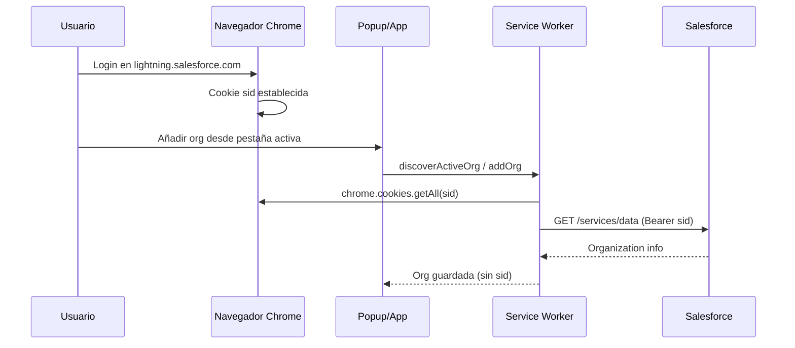

# 01 — Arquitectura y funcionalidades

## Descripción general

**Salesforce Org Compare** es una extensión Chrome Manifest V3 que permite a administradores y desarrolladores Salesforce:

- Comparar metadata entre orgs (diff visual con Monaco Editor)
- Ejecutar herramientas de desarrollo, análisis y monitorización
- Desplegar cambios de metadata en sandboxes (Quick Edit)
- Gestionar múltiples orgs guardadas desde el popup

La extensión **no implementa OAuth propio**. Reutiliza la sesión web del usuario leyendo la cookie `sid` del navegador cuando hay una pestaña Salesforce activa o una org guardada con sesión válida.

---

## Estructura del proyecto

```
SalesforceOrgCompare/
├── manifest.json              # Manifest MV3
├── background.js              # Entrada del service worker
├── background/
│   ├── messageHandlers.js     # Router central (~70 tipos de mensaje)
│   ├── orgHelpers.js          # SID, orgs guardadas, auth
│   ├── posthogTelemetry.js    # Telemetría HTTP (SW)
│   ├── featureControlsGuard.js
│   ├── caches.js              # Cachés en memoria
│   └── retrieveSession.js     # Cancelación de retrieves
├── popup/                     # UI del icono de extensión
├── code/                      # App principal (comparador + herramientas)
│   ├── code.html / code.js
│   ├── ui/                    # Paneles por herramienta (~30 archivos)
│   ├── lib/                   # Librerías (apex log viewer, charts)
│   ├── editor/                # Monaco, diffs
│   └── core/                  # Estado, bridge, persistencia
├── shared/                    # Lógica de dominio reutilizable
├── vendor/                    # Monaco, jsdiff, posthog-js
├── tests/                     # 57 archivos Vitest
└── scripts/                   # CI, PostHog flags, empaquetado Chrome Store
```

**No hay content scripts** en el manifest. La detección de org activa se hace leyendo la pestaña activa y cookies ([`shared/orgDiscovery.js`](../../shared/orgDiscovery.js)).

---

## Modos de navegación

Definidos en [`code/core/constants.js`](../../code/core/constants.js) y gestionados por [`code/ui/appModeNav.js`](../../code/ui/appModeNav.js):

| Modo | Descripción | Riesgo operativo |
|------|-------------|------------------|
| `comparator` | Comparación de metadata, búsqueda, retrieve | Medio |
| `development` | Tests, Quick Edit, Anonymous Apex, queries, logs | **Alto** |
| `analysis` | Dependencias, permisos, comparación de datos | Medio |
| `monitoring` | Salud org, límites, deploy status, auditoría | Bajo |
| `manifests` | Generación de package.xml | Bajo |

---

## Inventario de herramientas

### Modo Comparator (pantalla principal)

| Funcionalidad | UI | Mensajes SW | Shared | Escritura | Feature control |
|---------------|-----|-------------|--------|-----------|-----------------|
| Búsqueda metadata | [`code/ui/searchSetup.js`](../../code/ui/searchSetup.js) | `searchIndex`, `quickOpen:buildIndex` | `salesforceApi.js` | No | UI: `retrieve`; SW: **no** |
| Retrieve fuente | [`code/flows/retrieveFlow.js`](../../code/flows/retrieveFlow.js) | `fetchSource`, `retrieve:begin`, `retrieve:cancel` | `metadataRetrieve.js` | No | UI: `retrieve`, `compare_run`; SW: `retrieve` en ZIP |
| Diff Monaco | [`code/editor/`](../../code/editor/) | — (local) | `diffUtils.js` | No | UI: `compare_run` |
| Export HTML diff | [`code/editor/`](../../code/editor/) | — | — | No | Ninguno |
| Persistencia items | [`code/core/persistence.js`](../../code/core/persistence.js) | — | — | Storage local | Ninguno |

### Modo Development

| Herramienta | UI | Mensajes SW | Shared | Escritura | Feature control |
|-------------|-----|-------------|--------|-----------|-----------------|
| **ApexTests** | [`code/ui/apexTestsHubRuns.js`](../../code/ui/apexTestsHubRuns.js) | `apexTests:*` (~15 tipos) | `salesforceApi.js` | Ejecuta tests | UI + SW: `apex_test_run` |
| **QuickEdit** (Apex Class) | [`code/ui/quickEditPanel.js`](../../code/ui/quickEditPanel.js) | `searchIndex`, `fetchSource`, `metadata:deploy` | `metadataRetrieve.js` | **Deploy** | UI + SW: `deploy` / `quick_edit_save` |
| **LightningQuickEdit** | [`code/ui/lightningQuickEditPanel.js`](../../code/ui/lightningQuickEditPanel.js) | `metadata:deployBundle` | `metadataRetrieve.js` | **Deploy bundle** | UI + SW: `deploy` / `quick_edit_save` |
| **AnonymousApex** | Panel Anonymous Apex | `anonymousApex:execute`, `anonymousApex:getLogBody` | `salesforceApi.js` | **Execute anonymous** | UI + SW: `anonymous_apex_execute` |
| **QueryExplorer** | Panel Query Explorer | `queryExplorer:run`, `describeGlobal`, `describeSobject` | `salesforceApi.js` | SOQL read | Ninguno |
| **DebugLogBrowser** | [`code/ui/debugLogBrowserPanel.js`](../../code/ui/debugLogBrowserPanel.js) | `debugLogs:*` | `salesforceApi.js` | **deleteAll** | Ninguno |
| **ApexCoverageCompare** | Panel coverage | `apexCoverageCompare:fetch`, `getLineView` | `salesforceApi.js` | No | Ninguno |

### Modo Analysis

| Herramienta | UI | Mensajes SW | Shared | Escritura | Feature control |
|-------------|-----|-------------|--------|-----------|-----------------|
| **FieldDependency** | Panel field dependency | — (local/UI) | — | No | Por herramienta (UI) |
| **DependencyExplorer** | [`code/ui/dependencyExplorerPanel.js`](../../code/ui/dependencyExplorerPanel.js) | `dependencyExplorer:search`, `analyze` | `dependencyExplorer.js` | No | Por herramienta (UI) |
| **PermissionDiff** | Panel permisos | `permissionsDiff:*` (~6 tipos) | `permissionsDiffApi.js` | No | Por herramienta (UI) |
| **CustomSettingsCompare** | Panel custom settings | `customSettingsCompare:*` | `setupRecordsCompareApi.js` | No | Por herramienta (UI) |
| **CustomMetadataCompare** | Panel custom metadata | `customMetadataCompare:*` | `setupRecordsCompareApi.js` | No | Por herramienta (UI) |
| **RecordCompare** | [`code/ui/recordComparePanel.js`](../../code/ui/recordComparePanel.js) | `recordCompare:fetchPair` | `recordCompareApi.js` | No | Por herramienta (UI) |

### Modo Monitoring

| Herramienta | UI | Mensajes SW | Shared | Escritura | Feature control |
|-------------|-----|-------------|--------|-----------|-----------------|
| **EnvironmentStatus** | [`code/ui/environmentStatusPanel.js`](../../code/ui/environmentStatusPanel.js) | `environmentStatus:getAll` | `trustStatusApi.js` | No | Por herramienta (UI) |
| **OrgLimits** | Panel org limits | `orgLimits:get` | `salesforceApi.js` | No | Por herramienta (UI) |
| **DeployStatus** | [`code/ui/deployStatusPanel.js`](../../code/ui/deployStatusPanel.js) | `deployStatus:poll`, `cancel`, `detail` | `deployStatusApi.js` | Cancel deploy | Por herramienta (UI) |
| **SetupAuditTrail** | Panel audit trail | `setupAuditTrail:list` | `salesforceApi.js` | No | Por herramienta (UI) |
| **FieldHistory** | Panel field history | `fieldHistory:context`, `list` | `fieldHistoryApi.js` | No | Por herramienta (UI) |

### Modo Manifests

| Herramienta | UI | Mensajes SW | Shared | Escritura | Feature control |
|-------------|-----|-------------|--------|-----------|-----------------|
| **Package.xml generator** | [`code/ui/generatePackageXmlPanel.js`](../../code/ui/generatePackageXmlPanel.js) | `metadata:describeMetadata`, `listMetadata`, `retrievePackageXml` | `metadataRetrieve.js` | Retrieve ZIP | UI: `retrieve`; SW: `retrieve` |

### Visor Apex Log (página independiente)

| Funcionalidad | UI | Mensajes SW | Shared |
|---------------|-----|-------------|--------|
| Parser y vistas | [`code/apex-log-viewer.js`](../../code/apex-log-viewer.js) | `apexViewer:stage`, `apexViewer:take` | `apexLogParser.js`, `code/lib/apexLogViewer/*` |

---

## Autenticación y sesión

### Modelo



### Archivos clave

| Archivo | Responsabilidad |
|---------|-----------------|
| [`shared/orgDiscovery.js`](../../shared/orgDiscovery.js) | Descubrimiento de org desde pestaña activa, cookies `__Host-sid`, `sid`, `sid_Client` |
| [`background/orgHelpers.js`](../../background/orgHelpers.js) | Resolución SID por `orgId!` prefix, carga/guardado orgs, probe auth |
| [`shared/salesforceApi.js`](../../shared/salesforceApi.js) | REST/Tooling con `Authorization: Bearer {sid}`, rate limiter 5 req/s |
| [`shared/metadataRetrieve.js`](../../shared/metadataRetrieve.js) | Metadata API SOAP, retrieve/deploy |

### Estados de autenticación

| Estado | Significado |
|--------|-------------|
| `active` | SID válido, probe API OK |
| `expired` | Org guardada pero sin sesión activa |
| `NO_SID` | No hay cookie sid para la org |

### Aspectos positivos

- El SID **nunca** se guarda en `chrome.storage.sync` ni `local`.
- Export/import de orgs sanitiza credenciales ([`sanitizeOrgForConfigExport`](../../background/messageHandlers.js)).
- Dominios SF restringidos por allowlist ([`shared/sfDomains.js`](../../shared/sfDomains.js)).

### Riesgos conocidos

- Dependencia total de sesión del navegador; sin refresh token propio.
- `isSandbox` se persiste desde el cliente sin verificar API (ver [P0-2](./03-riesgos-criticos-codigo.md#p0-2-flag-issandbox-manipulable)).
- Enumeración amplia de cookies `sid` en todos los dominios SF permitidos.

---

## Persistencia local

### `chrome.storage.sync` (sincronizado con cuenta Google)

| Clave | Contenido | Sensibilidad |
|-------|-----------|--------------|
| `savedOrgs` | `id`, `displayName`, `instanceUrl`, `cookieDomain`, `apiVersion`, `isSandbox` | Medium — URLs y nombres de org |
| `savedOrgOrder` | Orden de orgs | Low |
| `orgAliases`, `orgGroups` | Alias y agrupaciones | Low |

Referencia: [`background/orgHelpers.js`](../../background/orgHelpers.js) líneas 59–76.

### `chrome.storage.local` (solo dispositivo)

| Clave | Contenido | Sensibilidad |
|-------|-----------|--------------|
| `savedCodeItems` | Items de comparación (metadata/código) | **High** — código de org sin cifrar |
| `soc_extension_config` | Preferencias + `telemetryEnabled` | Low |
| `sfoc_telemetry_install_id` | UUID pseudónimo | Low |
| `pinnedKeys` | Items fijados en comparador | Low |
| Perfiles Apex, onboarding, nav prefs | Estado UI | Low |
| `sfoc_feature_controls` | Cache de feature flags | Low |

Referencia: [`code/core/persistence.js`](../../code/core/persistence.js) — `saveItemsToStorage()` persiste `savedCodeItems`.

### Cachés en memoria (service worker)

| Caché | Contenido | TTL |
|-------|-----------|-----|
| `indexCache` | Índices de búsqueda metadata | Hasta invalidación |
| `sourceCache` | Fuentes recuperadas | Hasta invalidación |
| `authStatusCache` | Estado auth por org | Con TTL |
| `STAGING` (apex viewer) | Logs/código temporal | 15 min ([`background/apexViewerStaging.js`](../../background/apexViewerStaging.js)) |
| `apexLogContextCache` | Contexto parseado de logs | **Sin límite** (ver P2) |

---

## Permisos de extensión

Definidos en [`manifest.json`](../../manifest.json):

| Permiso | Uso |
|---------|-----|
| `cookies` | Leer `sid` de dominios Salesforce |
| `storage` | Orgs guardadas, items comparación, prefs |
| `tabs` | Detectar pestaña Salesforce activa |
| `alarms` | Heartbeat telemetría, limpieza trace flags |
| `notifications` | Notificación al completar tests Apex |

**Host permissions:** dominios Salesforce (`*.salesforce.com`, `*.force.com`, etc.), PostHog EU, `api.status.salesforce.com`, web pública `salesforceorgcompare.com`.

---

## Rate limiting

| Módulo | Límite |
|--------|--------|
| REST/Tooling ([`shared/salesforceApi.js`](../../shared/salesforceApi.js)) | 5 req/s |
| Metadata API ([`shared/metadataRetrieve.js`](../../shared/metadataRetrieve.js)) | 5 req/s |

---

## Control remoto de features

La extensión soporta kill switch remoto vía flag PostHog `sfoc_feature_controls`. Ver [04-telemetria-y-feature-flags.md](./04-telemetria-y-feature-flags.md) y [SFOC_FEATURE_CONTROLS.md](../SFOC_FEATURE_CONTROLS.md).

Acciones definidas en [`shared/featureControls.js`](../../shared/featureControls.js):

- `deploy`, `retrieve`, `compare_run`, `apex_test_run`, `anonymous_apex_execute`, `quick_edit_save`

**Gap:** no todas las acciones se aplican consistentemente en UI y service worker (ver [03-riesgos-criticos-codigo.md](./03-riesgos-criticos-codigo.md)).
