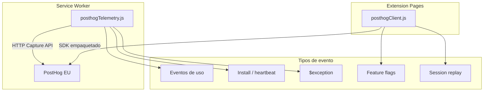

# 04 — Telemetría y feature flags

Documentación del sistema de telemetría PostHog, feature flags remotos y políticas de privacidad.

---

## Arquitectura de telemetría

La extensión usa **dos canales** para comunicarse con PostHog EU (`https://eu.i.posthog.com`):



| Canal | Archivo | Uso |
|-------|---------|-----|
| HTTP directo (SW) | [`background/posthogTelemetry.js`](../../background/posthogTelemetry.js) | Eventos de uso, lifecycle, excepciones `$exception` |
| SDK empaquetado | [`shared/posthogClient.js`](../../shared/posthogClient.js) + [`vendor/posthog-js/`](../../vendor/posthog-js/) | UI: flags, session replay, CSAT, widget soporte |

### Configuración

| Archivo | Rol |
|---------|-----|
| [`shared/telemetryConfig.example.js`](../../shared/telemetryConfig.example.js) | Plantilla con clave vacía (commiteada) |
| [`shared/telemetryConfig.js`](../../shared/telemetryConfig.js) | Config producción (**gitignored**) |
| [`scripts/ensureTelemetryConfig.mjs`](../../scripts/ensureTelemetryConfig.mjs) | Copia example en CI/tests (`pretest`) |
| [`shared/posthogConfigured.js`](../../shared/posthogConfigured.js) | Valida clave `phc_*` sin placeholder |

---

## Identificadores y contexto

| Identificador | Archivo | Descripción |
|---------------|---------|-------------|
| `sfoc_telemetry_install_id` | [`shared/telemetryInstallId.js`](../../shared/telemetryInstallId.js) | UUID pseudónimo por instalación |
| Session ID | Generado por sesión | Para correlación de eventos |
| `sf_user_label` | [`shared/telemetryUserContext.js`](../../shared/telemetryUserContext.js) | Etiqueta usuario SF (sanitizada) |
| Contexto org | [`shared/telemetryOrgContext.js`](../../shared/telemetryOrgContext.js) | Nombres empresa, URLs sandbox |

**URLs sanitizadas:** [`telemetrySafeComparisonUrl`](../../shared/posthogEventMap.js) — no envía URL completa de chrome-extension.

---

## Opt-out y preferencias

Configuración en [`shared/extensionSettings.js`](../../shared/extensionSettings.js) → `telemetryEnabled` (default `true`).

| Acción | Handler | Respeta opt-out |
|--------|---------|-----------------|
| Desactivar telemetría | `telemetry:opt-out` | — |
| Reactivar telemetría | `telemetry:opt-in` | — |
| Eventos de uso | `usage:log` → `sendPosthogOperationalFailure` | **Sí** |
| Lifecycle (install, heartbeat) | `extensionLifecycleTelemetry.js` | **Sí** (salvo `force`) |
| Excepciones `$exception` | `sendPosthogException` | **No** |
| Captura temprana | `installEarlyExceptionCapture.js` | **No** |
| Session replay | `posthogSessionReplay.js` | **Sí** |
| CSAT survey | `posthogCsatSurvey.js` | Condicional |

**Gap crítico (SEC-01):** Usuarios que desactivan telemetría en Ajustes siguen enviando excepciones. Ver [02-seguridad-y-privacidad.md](./02-seguridad-y-privacidad.md#sec-01-excepciones-posthog-ignoran-opt-out).

---

## Datos enviados a PostHog

### Eventos de uso

Mapeados en [`shared/posthogEventMap.js`](../../shared/posthogEventMap.js) desde [`shared/usageLogEntry.js`](../../shared/usageLogEntry.js).

**Propiedades permitidas (allowlist):**

| Propiedad | Descripción | Sanitización |
|-----------|-------------|--------------|
| `element_name` | Nombre elemento UI | Allowlist |
| `metadata_key` | Clave metadata comparada | Allowlist descriptor keys |
| `class_names` | Nombres clases Apex | Sí |
| `artifact_type` | Tipo herramienta | Allowlist |
| `left_company_name`, `right_company_name` | Nombres org | Truncado |
| `left_sandbox_url`, `right_sandbox_url` | URLs instancia | Truncado |
| `sf_user_label` | Usuario SF | Sanitizado |

**Descriptor keys permitidas:** `name`, `key`, `fileName`, `parentKey`, `relativePath`, `objectApiName`, `fieldApiName`, etc. (ver `POSTHOG_DESCRIPTOR_KEYS` en posthogEventMap.js).

### Excepciones

| Propiedad | Límite |
|-----------|--------|
| `$exception_message` | 2000 chars |
| `$exception_list` (stack) | 8000 chars |
| `$exception_fingerprint` | Hash para deduplicación |
| Contexto adicional | **Sin allowlist** (SEC-02) |

Clasificación bug vs operational: [`shared/errorTelemetryPolicy.js`](../../shared/errorTelemetryPolicy.js).

### Lifecycle

| Evento | Trigger |
|--------|---------|
| `extension_installed` | Primera instalación |
| `extension_active` | Heartbeat cada 12h |
| `extension_uninstalled` | Ping en página uninstall-feedback |
| `telemetry_enabled` / `telemetry_disabled` | Cambio preferencia |

---

## Feature flags remotos

### sfoc_feature_controls

| Campo | Valor |
|-------|-------|
| **Flag PostHog** | `sfoc_feature_controls` |
| **Archivo** | [`shared/posthogFeatureControlsFlag.js`](../../shared/posthogFeatureControlsFlag.js) |
| **Guard SW** | [`background/featureControlsGuard.js`](../../background/featureControlsGuard.js) |
| **Fail-open** | **Sí** — si PostHog no responde, todo habilitado |
| **Documentación** | [SFOC_FEATURE_CONTROLS.md](../SFOC_FEATURE_CONTROLS.md) |

**Estructura del payload:**

```json
{
  "version": 1,
  "global": { "message": { "es": "...", "en": "..." } },
  "modes": { "development": { "hidden": true } },
  "tools": { "QuickEdit": { "hidden": true } },
  "metadataTypes": { "ApexClass": { "hidden": true } },
  "actions": { "deploy": { "disabled": true, "message": { "es": "..." } } }
}
```

**Acciones bloqueables:** `deploy`, `retrieve`, `compare_run`, `apex_test_run`, `anonymous_apex_execute`, `quick_edit_save`.

**Gap:** Enforcement incompleto en SW (ver [P1-1](./03-riesgos-criticos-codigo.md#p1-1-feature-controls-bypass-en-lectura-de-metadata)).

### sfoc_popup_controls

| Campo | Valor |
|-------|-------|
| **Flag PostHog** | `sfoc_popup_controls` |
| **Archivo** | [`shared/posthogPopupControlsFlag.js`](../../shared/posthogPopupControlsFlag.js) |
| **Fail-open** | **Sí** |
| **Documentación** | [SFOC_POPUP_CONTROLS.md](../SFOC_POPUP_CONTROLS.md) |

Controles: deshabilitar botón "Abrir app", mostrar avisos/banners en popup.

**Gap:** `hookPopupControlsOnFeatureFlags` no invocado (ver [P1-2](./03-riesgos-criticos-codigo.md#p1-2-popup-controls-sin-actualización-en-vivo)).

### Otros flags

| Flag | Script | Propósito |
|------|--------|-----------|
| Session replay | `scripts/createPosthogSessionReplayFlag.mjs` | Grabación condicional UI |
| CSAT survey | `scripts/createPosthogCsatSurvey.mjs` | Encuesta tras N comparaciones |
| Support widget | `scripts/createPosthogSupportFlag.mjs` | Widget soporte en app |

Scripts de administración documentados en [SFOC_DEV_ADMIN_TOOLS.md](../SFOC_DEV_ADMIN_TOOLS.md).

---

## Política de privacidad y cumplimiento

| Recurso | URL / Archivo |
|---------|---------------|
| Política de privacidad | `https://salesforceorgcompare.web.app/privacy-polity.html` |
| Constante en código | [`PRIVACY_POLICY_URL`](../../code/core/constants.js) |
| Página desinstalación | [`UNINSTALL_FEEDBACK_URL`](../../code/core/constants.js) |
| Proyecto PostHog | EU, proyecto "Salesforce Org Compare" |

### Recomendaciones para entornos enterprise

1. **Revisión DPO/legal** antes de despliegue en organizaciones reguladas (CaixaBank).
2. Evaluar si `metadata_key`, URLs de sandbox y `sf_user_label` son aceptables según política de datos.
3. Decidir política de error tracking vs opt-out (SEC-01).
4. Documentar fail-open de feature controls para incident response.
5. Considerar desactivar session replay en despliegues enterprise.

---

## Comportamiento fail-open

| Componente | Sin red PostHog | Impacto |
|------------|-----------------|---------|
| Feature controls | Todo habilitado | No se puede forzar kill switch remoto |
| Popup controls | Defaults (todo habilitado) | No se puede bloquear popup remotamente |
| Telemetría uso | Eventos no enviados | Sin impacto funcional |
| Excepciones | No enviadas si no configurado | Sin impacto funcional |

**Diseño intencional:** Prioriza disponibilidad sobre control remoto en caso de caída de PostHog. Documentado en SFOC_FEATURE_CONTROLS.md.

**Mitigación opcional:** Cachear último payload bloqueante en `chrome.storage.local` para aplicar offline.

---

## Scripts npm PostHog

Definidos en [`package.json`](../../package.json):

| Script | Acción |
|--------|--------|
| `posthog:feature-controls` | Crear flag feature controls |
| `posthog:popup-controls` | Crear flag popup controls |
| `posthog:replay-flag` | Crear flag session replay |
| `posthog:survey` | Crear encuesta CSAT |
| `posthog:support-flag` | Crear flag soporte |

Requieren `POSTHOG_PERSONAL_API_KEY` en `.env` (solo desarrollo, gitignored).
