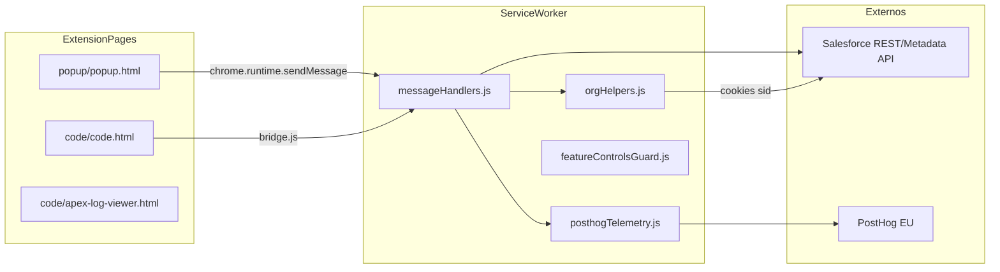

# Análisis pre-producción — Salesforce Org Compare

Informe de readiness para el lanzamiento a producción de la extensión Chrome **Salesforce Org Compare** (MV3). Complementa las guías operativas existentes en [`docs/`](../SFOC_FEATURE_CONTROLS.md).

**Fecha del análisis:** junio 2026  
**Versión manifest:** `2.11` ([`manifest.json`](../../manifest.json))  
**Versión package.json:** `2.5.0` ([`package.json`](../../package.json)) — **desalineación detectada**  
**Tests:** 57 archivos, 365 tests — todos pasando (Vitest 3.2.4)

---

## Veredicto de lanzamiento

**Apto con reservas.**

La extensión no expone credenciales Salesforce en el repositorio ni en `chrome.storage`. El modelo de autenticación (cookie `sid` en runtime) y la validación de remitentes (`trustedSender`) son sólidos para una extensión de sesión de navegador.

Sin embargo, existen **riesgos operativos** que deben abordarse antes de un despliegue en entornos enterprise (p. ej. CaixaBank):

1. Deploy a producción bloqueado solo en UI, no en el service worker.
2. Telemetría de errores (`$exception`) que ignora el opt-out del usuario.
3. Feature controls remotos con bypass parcial en el background.
4. Metadata/código de orgs almacenado localmente sin cifrar.

Ninguno de estos hallazgos implica una vulnerabilidad crítica de credenciales, pero sí impacto operativo, privacidad y cumplimiento.

---

## Índice de documentos

| Documento | Contenido |
|-----------|-----------|
| [01-arquitectura-y-funcionalidades.md](./01-arquitectura-y-funcionalidades.md) | Inventario de herramientas, flujos auth, persistencia |
| [02-seguridad-y-privacidad.md](./02-seguridad-y-privacidad.md) | Hallazgos SEC-01 a SEC-08, controles existentes |
| [03-riesgos-criticos-codigo.md](./03-riesgos-criticos-codigo.md) | P0–P3: deploy, feature controls, robustez |
| [04-telemetria-y-feature-flags.md](./04-telemetria-y-feature-flags.md) | PostHog, opt-out, flags remotos |
| [05-testing-ci-y-operaciones.md](./05-testing-ci-y-operaciones.md) | Cobertura, huecos, CI, checklist release |
| [06-plan-remediacion.md](./06-plan-remediacion.md) | Plan priorizado con criterios de aceptación |

### Documentación operativa relacionada

- [SFOC_FEATURE_CONTROLS.md](../SFOC_FEATURE_CONTROLS.md) — kill switch remoto de herramientas
- [SFOC_POPUP_CONTROLS.md](../SFOC_POPUP_CONTROLS.md) — avisos y bloqueos en popup
- [SFOC_DEV_ADMIN_TOOLS.md](../SFOC_DEV_ADMIN_TOOLS.md) — administración PostHog

---

## Top 5 hallazgos

| # | ID | Severidad | Hallazgo | Documento |
|---|-----|-----------|----------|-----------|
| 1 | P0-1 | **P0** | Deploy a producción sin guard en service worker | [03-riesgos-criticos-codigo.md](./03-riesgos-criticos-codigo.md#p0-1-deploy-a-producción-sin-guard-en-service-worker) |
| 2 | SEC-01 | **High** | `$exception` no respeta `telemetryEnabled` | [02-seguridad-y-privacidad.md](./02-seguridad-y-privacidad.md#sec-01-excepciones-posthog-ignoran-opt-out) |
| 3 | P0-2 | **P0** | Flag `isSandbox` manipulable al importar orgs | [03-riesgos-criticos-codigo.md](./03-riesgos-criticos-codigo.md#p0-2-flag-issandbox-manipulable) |
| 4 | P1-1 | **P1** | Feature controls bypass en `fetchSource` / `searchIndex` | [03-riesgos-criticos-codigo.md](./03-riesgos-criticos-codigo.md#p1-1-feature-controls-bypass-en-lectura-de-metadata) |
| 5 | SEC-03 | **High** | Código/metadata en `chrome.storage.local` sin cifrar | [02-seguridad-y-privacidad.md](./02-seguridad-y-privacidad.md#sec-03-metadata-en-storage-local-sin-cifrar) |

---

## Matriz resumen

| Área | Crítico | High | Medium | Low | Estado |
|------|---------|------|--------|-----|--------|
| Seguridad credenciales | 0 | 0 | 2 | 1 | Mitigado (SID no en storage) |
| Seguridad operativa (deploy) | 2 | 0 | 1 | 0 | **Abierto** |
| Privacidad / telemetría | 0 | 3 | 2 | 0 | **Abierto** |
| Feature controls | 0 | 0 | 2 | 0 | **Abierto** |
| XSS | 0 | 0 | 2 | 0 | **Abierto** |
| Robustez código | 0 | 0 | 4 | 2 | **Abierto** |
| Testing / CI | 0 | 0 | 3 | 2 | Parcial (tests unitarios OK) |
| Versionado | 0 | 0 | 1 | 0 | **Abierto** (manifest vs package.json) |

---

## Arquitectura general

### Flujo de mensajes

1. Las páginas de extensión (`popup/`, `code/`) envían mensajes al service worker vía `chrome.runtime.sendMessage`.
2. El bridge principal está en [`code/core/bridge.js`](../../code/core/bridge.js); el popup usa `bg()` en [`popup/popup.js`](../../popup/popup.js).
3. [`background/messageHandlers.js`](../../background/messageHandlers.js) (~3.600 líneas) enruta ~70 tipos de mensaje a módulos `shared/`.
4. Todas las peticiones HTTP a Salesforce se ejecutan en el SW (no aparecen en DevTools Network de `code.html`).
5. La autenticación usa cookies `sid` leídas en runtime; nunca se persisten en storage.

### Puntos de entrada

| Entrada | Archivo | Propósito |
|---------|---------|-----------|
| Popup | `popup/popup.html` | Gestión de orgs, ajustes, abrir app |
| App principal | `code/code.html` | Comparador y herramientas |
| Visor logs Apex | `code/apex-log-viewer.html` | Análisis de debug logs |
| Ajustes | `popup/settings.html` | Telemetría, idioma, preferencias |
| Service worker | `background.js` | API Salesforce, cachés, telemetría |

---

## Aspectos positivos destacados

- **SID nunca en storage:** solo cookies en runtime ([`background/orgHelpers.js`](../../background/orgHelpers.js)).
- **Validación de remitente:** [`shared/trustedSender.js`](../../shared/trustedSender.js).
- **CSP restrictiva:** `script-src 'self'` sin `unsafe-eval` ([`manifest.json`](../../manifest.json)).
- **Sin secretos commiteados:** `telemetryConfig.js` y `.env` en `.gitignore`.
- **365 tests unitarios** pasando en lógica de dominio (`shared/`, parsers, telemetría).
- **Control remoto** de features vía PostHog con documentación operativa.
- **Errores enmascarados** al usuario en la mayoría de flujos API (`sanitizeUiError`).

---

## Próximos pasos recomendados

Ver [06-plan-remediacion.md](./06-plan-remediacion.md) para el plan de correcciones priorizado. Los ítems P0 (guard deploy en SW, verificación `isSandbox` desde API) deberían resolverse antes de un rollout enterprise.
